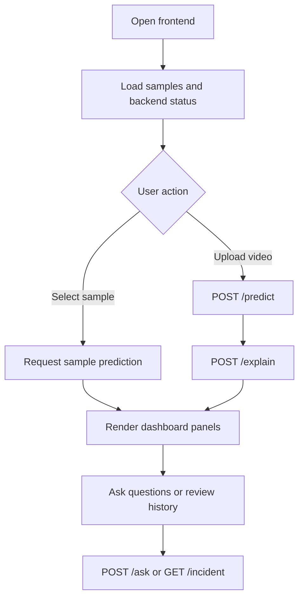
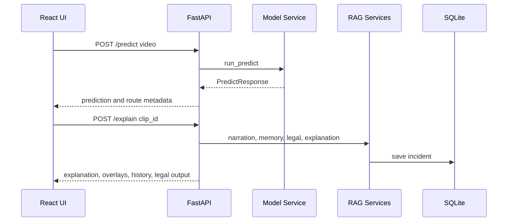
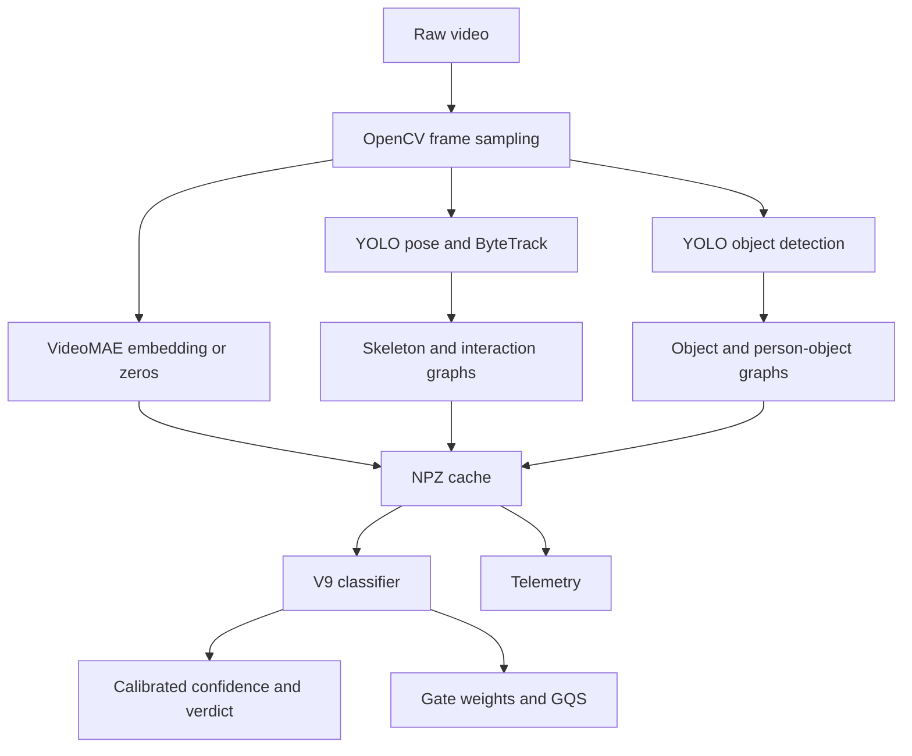
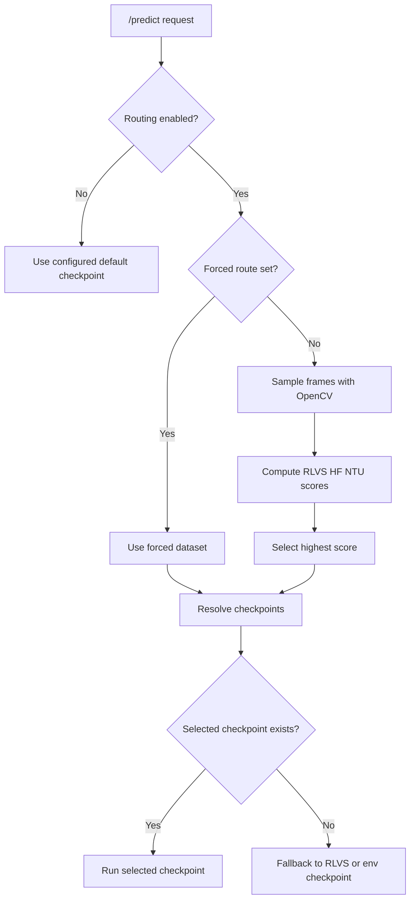
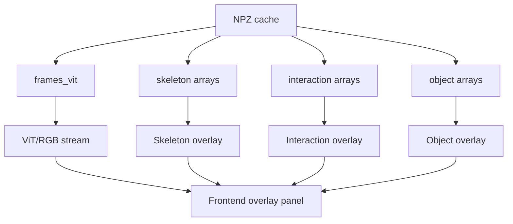
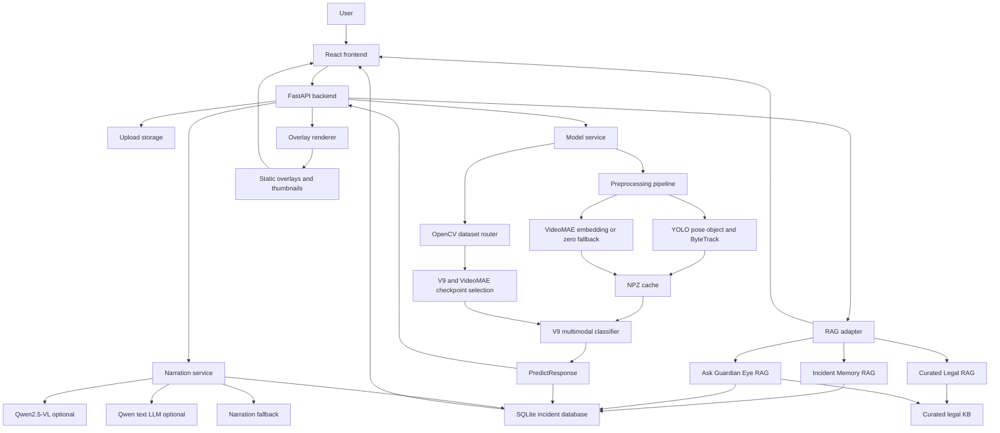

# Guardian Eye Demo System README

## Table of Contents

1. [System Purpose](#system-purpose)
2. [Repository Map](#repository-map)
3. [Tool Stack](#tool-stack)
4. [Frontend Demo Flow](#frontend-demo-flow)
5. [Backend API Flow](#backend-api-flow)
6. [Prediction Pipeline](#prediction-pipeline)
7. [Dataset Routing and Checkpoint Switching](#dataset-routing-and-checkpoint-switching)
8. [Confidence, Thresholds, and Verdict Interpretation](#confidence-thresholds-and-verdict-interpretation)
9. [Overlay and Evidence Visualization](#overlay-and-evidence-visualization)
10. [Narration and RAG Features](#narration-and-rag-features)
11. [Incident History Persistence](#incident-history-persistence)
12. [Running the Demo](#running-the-demo)
13. [Configuration Reference](#configuration-reference)
14. [Known Fallbacks and Demo Limitations](#known-fallbacks-and-demo-limitations)
15. [Validation and Tests](#validation-and-tests)
16. [Full System Architecture](#full-system-architecture)

## System Purpose

Guardian Eye is a local demonstration system for AI-powered violence detection and video intelligence. It accepts uploaded video clips or predefined samples, runs a multimodal violence classifier, renders evidence overlays, generates an explanation, retrieves related incident memory, and optionally produces country-specific legal consequence summaries.

The demo is designed for a thesis defense environment where reliability matters as much as model sophistication. Expensive model components are loaded only when needed, and the application exposes fallback metadata when a model cannot run on the local machine.

## Repository Map

| Path | Role |
|---|---|
| `Backend_Ashour/BackEnd` | FastAPI backend, model service, preprocessing, classifier inference, RAG services, database, tests |
| `FrontEnd` | React TypeScript demo interface |
| `FULL_RAG_Pipeline` | Research RAG pipeline, legal indexing, reference corpus, FAISS assets, tests, technical documentation |
| `models` | Expected local model checkpoints for V9, VideoMAE, Qwen, and related components |
| `RAG_PIPELINE_README.md` | RAG-specific documentation |
| `DEMO_SYSTEM_README.md` | This full-system documentation |
| `NON_TECHNICAL_USER_GUIDE.md` | Operator-oriented guide |

## Tool Stack

| Layer | Stack |
|---|---|
| Frontend | React 19, TypeScript, Vite, Tailwind CSS, shadcn-style UI components, Radix UI, lucide-react, Axios |
| Backend API | FastAPI, Pydantic, SQLAlchemy, SQLite |
| Video processing | OpenCV, NumPy, Ultralytics YOLO pose/object models, ByteTrack |
| Classification | V9 multimodal classifier with skeleton, interaction, object, and VideoMAE/RGB streams |
| Appearance embedding | VideoMAE encoder, with zero-embedding fallback when unavailable |
| RAG and generation | Qwen2.5-VL for visual narration when available, Qwen2.5 text LLM for Ask and legal summaries when available |
| Retrieval | SQLite history, JSON hashed lexical vector store, curated legal KB, optional FAISS assets in `FULL_RAG_Pipeline` |
| Persistence | SQLite incidents table plus generated overlay, thumbnail, and NPZ cache files |

## Frontend Demo Flow

The frontend is a single-page demo application centered on `FrontEnd/src/pages/DemoPage.tsx`. It begins with a splash screen and then shows the Guardian Eye operating dashboard.

Primary user-facing sections:

- Sample gallery for seeded demo clips.
- Country selector for legal consequence summaries.
- Upload panel for custom videos.
- Verdict panel with confidence animation.
- Timeline and peak activity display.
- Gate bar showing stream contributions and stream validity.
- Four-stream overlay video area: skeleton, interaction, object, and ViT/RGB.
- Narrative panel for explanation output.
- Incident history panel.
- Legal consequences panel.
- Ask Guardian Eye question box.



The frontend can operate in mock mode or backend mode. `VITE_API_BASE_URL` points to the FastAPI backend, while `VITE_API_MODE` controls whether the frontend uses backend calls or mock data.

## Backend API Flow

The main backend entry point is `Backend_Ashour/BackEnd/main.py`.

| Endpoint | Purpose |
|---|---|
| `GET /health` | Backend health and mode check |
| `GET /samples` | Demo sample metadata |
| `POST /predict` | Upload a video and run prediction |
| `POST /explain` | Generate overlays, narration, RAG payloads, and save incident |
| `GET /overlay/{clip_id}` | Retrieve overlay media |
| `GET /history` | Query saved incidents |
| `GET /incident/{incident_id}` | Reconstruct a saved incident review |
| `POST /legal-consequences` | Request legal consequence RAG output |
| `POST /ask` | Ask Guardian Eye about current or historical incidents |



## Prediction Pipeline

The real prediction path is implemented by:

- `model_service.py`
- `inference_preprocess.py`
- `inference_classifier.py`
- `v9_model.py`
- `dataset_router.py`

The pipeline:

1. Saves the uploaded video.
2. Optionally routes the clip to a dataset-specific checkpoint.
3. Samples graph frames and VideoMAE frames.
4. Runs YOLO pose and object detection.
5. Builds skeleton, person-person, object, and person-object graph tensors.
6. Computes graph quality scores.
7. Loads VideoMAE when available and writes `vit_embedding`; otherwise writes zeros.
8. Runs V9 classifier.
9. Applies calibration and threshold.
10. Derives telemetry such as people count, peak window, and weapon/object proximity.
11. Returns a structured `PredictResponse`.



## Dataset Routing and Checkpoint Switching

Dataset routing is implemented as a lightweight OpenCV/frame-feature router in `Backend_Ashour/BackEnd/dataset_router.py`.

It deliberately does not use Qwen2.5-VL inside `/predict`. VLM routing was considered too expensive for the demo machine because it would add model-loading latency, consume substantial GPU memory, and slow down the critical upload-to-verdict path. The VLM is kept for post-prediction narration only.

### Routing Features

The router samples a small number of frames and computes simple features:

- Bright low-saturation `ice_ratio` for hockey-like footage.
- Green ratio for outdoor or public-scene cues.
- Dark ratio.
- Edge density.
- Vertical edge ratio for CCTV-like fixed scenes.
- Camera or scene motion.
- Motion variance.

### Route Outputs

The API can include `model_route` metadata:

| Field | Meaning |
|---|---|
| `selected_dataset` | `RLVS`, `HF`, or `NTU` |
| `routing_confidence` | Normalized score for selected route |
| `routing_reason` | Human-readable route reason |
| `dataset_similarity` | Similarity scores for RLVS, HF, and NTU |
| `selected_v9_checkpoint` | Selected V9 checkpoint label |
| `selected_videomae_checkpoint` | Selected VideoMAE checkpoint label |
| `route_source` | `rules`, `forced`, or `fallback` |
| `fallback_used` | Whether selected checkpoints were unavailable and fallback was used |

### Checkpoint Priority

For each selected dataset:

1. Use the selected dataset checkpoint when present.
2. Fall back to RLVS checkpoint.
3. Fall back to configured `GUARDIAN_V9_CKPT` or `GUARDIAN_VIDEOMAE_CKPT`.



## Confidence, Thresholds, and Verdict Interpretation

The classifier returns a probability-like confidence after sigmoid and optional temperature calibration. The final verdict is computed by comparing confidence against a threshold loaded from the checkpoint or overridden by environment variable.

Important thesis and demo interpretation:

- A moderate confidence can still produce a violence verdict if the checkpoint threshold is lower than 0.50.
- This is not a frontend bug. The frontend displays the backend verdict and confidence.
- Threshold choice is a model calibration issue.
- `GUARDIAN_THRESHOLD` can override the threshold for controlled demos.
- `GUARDIAN_CAL_TEMP` can adjust temperature scaling.
- Dataset routing may improve checkpoint fit, but it is not a replacement for formal probability calibration.

## Overlay and Evidence Visualization

Overlay rendering is implemented in `overlay_service.py`. The frontend displays four slots:

- Skeleton stream.
- Interaction stream.
- Object stream.
- ViT/RGB stream.

When real NPZ cache data is available, the backend renders stream-specific videos and thumbnails. If stream data is missing, the response marks missing or fallback placeholder status. The frontend intentionally displays this status so unavailable streams are not mistaken for evidence.



## Narration and RAG Features

The explanation step performs post-prediction enrichment:

- Deterministic evidence packet from classifier outputs.
- VLM summary when Qwen2.5-VL can load.
- Text LLM narration when available.
- Deterministic narration fallback when unavailable.
- Incident memory retrieval.
- Legal consequences RAG.
- Ask RAG support for follow-up questions.

The narration layer must not contradict the classifier verdict. It is a narrator, not a judge.

## Incident History Persistence

Incidents are saved after `/explain`, not immediately after `/predict`. This means a complete history item contains:

- Prediction fields.
- Gate weights and graph quality scores.
- Telemetry.
- Overlay and thumbnail paths.
- Evidence packet.
- Narrative.
- VLM summary when available.
- Dataset route metadata when available and safe to persist.

The `IncidentRecord` table includes `model_route_json`, allowing later incident review and thesis analysis to show which dataset route and checkpoint were used.

## Running the Demo

Use a local backend and frontend in separate terminals.

### Backend

```powershell
cd "D:\sara\graduation\Demo Implementation\Backend_Ashour\BackEnd"
$env:GUARDIAN_MOCK="0"
$env:GUARDIAN_MODEL_ROUTING_ENABLED="1"
$env:GUARDIAN_V9_CKPT="D:\sara\graduation\Demo Implementation\models\v9\RLVS_best.pt"
$env:GUARDIAN_VIDEOMAE_CKPT="D:\sara\graduation\Demo Implementation\models\videomae\RLVS_videomae_best.pt"
$env:GUARDIAN_VLM_MODEL_ID="D:\sara\graduation\Demo Implementation\models\Qwen2.5-VL-3B-Instruct"
$env:GUARDIAN_LLM_MODEL_ID="D:\sara\graduation\Demo Implementation\models\qwen2.5-1.5b-instruct"
$env:GUARDIAN_ASK_LLM_MODEL_ID=$env:GUARDIAN_LLM_MODEL_ID
$env:GUARDIAN_LEGAL_LLM_MODEL_ID=$env:GUARDIAN_LLM_MODEL_ID
$env:GUARDIAN_NARRATION_ENABLED="1"
$env:GUARDIAN_ASK_RAG_ENABLED="1"
$env:GUARDIAN_LEGAL_LLM_ENABLED="1"
$env:GUARDIAN_MODEL_LOCAL_ONLY="1"
$env:GUARDIAN_RAG_PIPELINE_PATH="D:\sara\graduation\Demo Implementation\FULL_RAG_Pipeline"
.\.venv\Scripts\python.exe -m uvicorn main:app --host 127.0.0.1 --port 8000
```

### Frontend

```powershell
cd "D:\sara\graduation\Demo Implementation\FrontEnd"
$env:VITE_API_BASE_URL="http://127.0.0.1:8000"
npm.cmd run dev
```

Open the Vite URL printed by the frontend terminal.

## Configuration Reference

| Environment variable | Purpose | Default or behavior |
|---|---|---|
| `GUARDIAN_MOCK` | Use mock backend outputs | `1` by default |
| `GUARDIAN_MODEL_ROUTING_ENABLED` | Enable lightweight dataset routing | `0` by default |
| `GUARDIAN_FORCE_DATASET_ROUTE` | Force `RLVS`, `HF`, or `NTU` route | Empty by default |
| `GUARDIAN_MODEL_ROOT` | Root used to resolve relative checkpoint paths | Project root |
| `GUARDIAN_V9_CKPT` | Default V9 checkpoint | Required in real mode if no routed checkpoint |
| `GUARDIAN_VIDEOMAE_CKPT` | Default VideoMAE checkpoint | Optional, zeros if missing |
| `GUARDIAN_THRESHOLD` | Override classifier threshold | Checkpoint threshold if present |
| `GUARDIAN_CAL_TEMP` | Temperature calibration value | `1.0` |
| `GUARDIAN_VLM_MODEL_ID` | VLM model path or id | Local/demo dependent |
| `GUARDIAN_LLM_MODEL_ID` | Shared text LLM path or id | Local/demo dependent |
| `GUARDIAN_ASK_RAG_ENABLED` | Enable Ask RAG | Enabled unless set to disabled in code path |
| `GUARDIAN_LEGAL_LLM_ENABLED` | Enable legal LLM generation | `1` |
| `GUARDIAN_MODEL_LOCAL_ONLY` | Load model files locally only | `1` |
| `VITE_API_BASE_URL` | Frontend backend URL | `http://localhost:8000` |
| `VITE_API_MODE` | Frontend mock/backend mode | Project dependent |

## Known Fallbacks and Demo Limitations

| Limitation or failure | Current behavior |
|---|---|
| Qwen2.5-VL cannot fit in GPU memory | Narration falls back to deterministic classifier-based text |
| Windows paging file too small for text LLM | Ask or legal generation falls back with reason metadata |
| Legal LLM unavailable locally | Curated deterministic legal summary is returned |
| VideoMAE checkpoint missing | Zero embedding is stored and ViT stream is marked inactive or partial |
| Dataset-specific checkpoint missing | Router falls back to RLVS or configured environment checkpoint |
| VLM route would be more semantically rich | Not used inside `/predict` because it is too slow and memory-heavy |
| Confidence and verdict appear inconsistent to a casual viewer | Threshold and calibration explain the result; frontend displays backend truth |
| Legal output requested without country | Legal panel asks for country selection |
| Non-violent verdict | Legal panel returns no legal consequences suggested |

## Validation and Tests

Useful backend tests:

- `Backend_Ashour/BackEnd/tests/test_dataset_router.py`
- `Backend_Ashour/BackEnd/tests/test_gate_validity.py`
- `Backend_Ashour/BackEnd/tests/test_overlay_status.py`
- `Backend_Ashour/BackEnd/tests/test_narration_service.py`
- `Backend_Ashour/BackEnd/tests/test_curated_legal_service.py`
- `Backend_Ashour/BackEnd/tests/test_ask_rag_service.py`
- `Backend_Ashour/BackEnd/tests/test_incident_memory_service.py`
- `Backend_Ashour/BackEnd/tests/test_rag_integration.py`

Useful full RAG tests:

- `FULL_RAG_Pipeline/tests/test_all_rags_mock_e2e.py`
- `FULL_RAG_Pipeline/tests/test_bilingual_rag.py`
- `FULL_RAG_Pipeline/tests/test_legal_guardrails.py`
- `FULL_RAG_Pipeline/tests/test_legal_rag_e2e.py`
- `FULL_RAG_Pipeline/tests/test_semantic_retrieval.py`

For a thesis demo, validation should include:

1. Backend health endpoint returns connected mode.
2. Frontend status badge reports backend connected.
3. A known sample produces prediction, overlay status, narration, history, and Ask response.
4. A custom uploaded clip returns `model_route` when routing is enabled.
5. Missing VLM or LLM resources produce fallback metadata instead of crashing.
6. Legal panel behaves correctly for no country, supported country, and non-violent verdict.

## Full System Architecture


