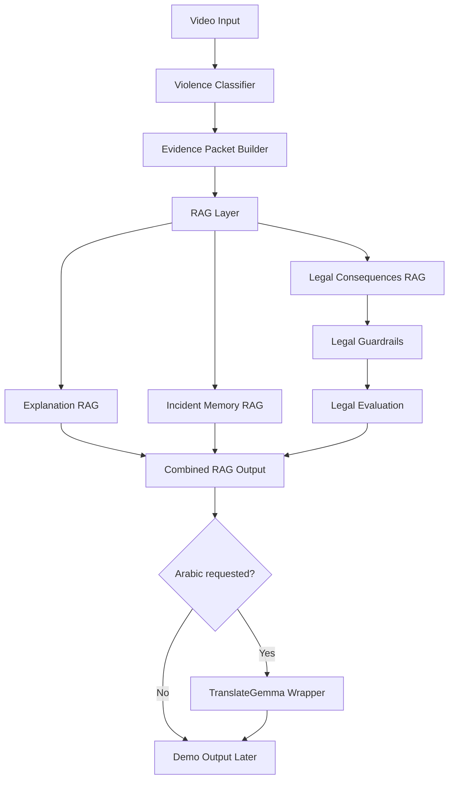
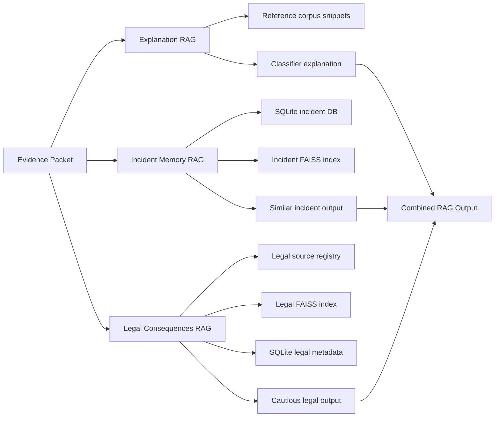
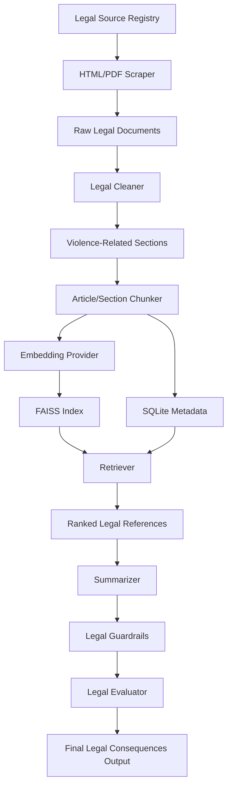
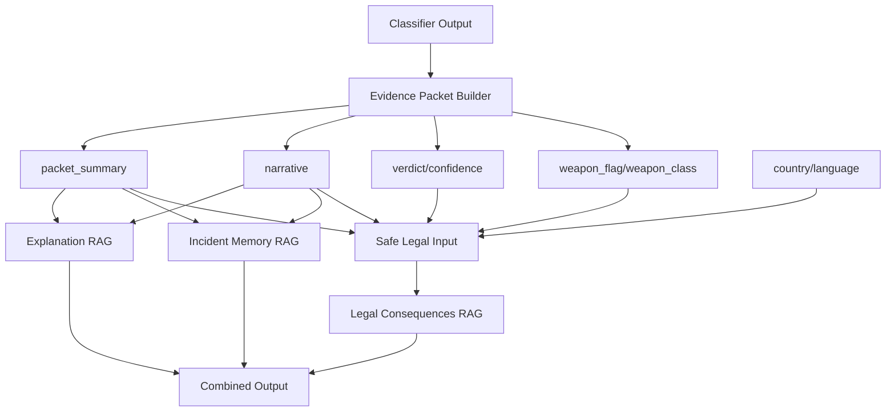
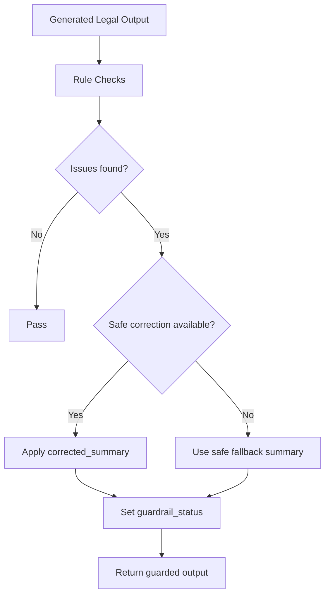
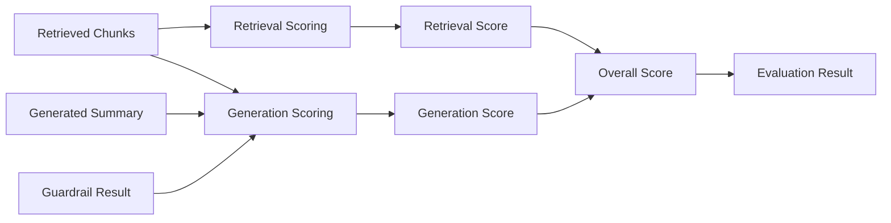
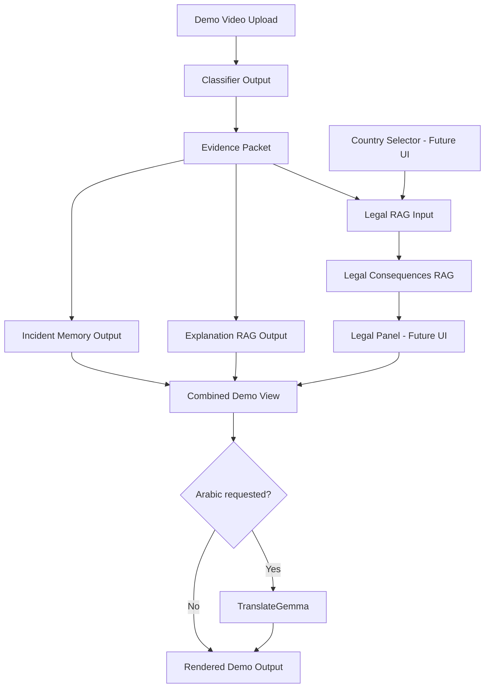

# Guardian Eye RAG Technical Documentation

## 1. Project Overview

Guardian Eye is a violence-detection RAG pipeline that treats the classifier as the authoritative source for incident classification, then uses retrieval components to explain, contextualize, and constrain downstream outputs. The current backend contains three RAG paths:

1. Explanation RAG: explains the classifier decision using an evidence packet and reference corpus.
2. Incident Memory / Historical RAG: searches prior incident records and similar historical cases.
3. Legal Consequences RAG: retrieves legal references, produces a cautious grounded legal consequence summary, validates it with guardrails, and scores it with deterministic evaluation helpers.

The repository also includes an Arabic/English translation wrapper around RAG entry points. The wrapper uses TranslateGemma to translate Arabic input to English, run the English RAG path, and translate user-facing output back to Arabic.

This document covers the full backend RAG architecture. It intentionally does not describe a completed frontend integration because the Legal Consequences RAG path has not yet been wired into the final demo UI.

## 2. Full System Architecture



### Architectural Roles

| Layer | Responsibility | Key files |
|---|---|---|
| Classifier adapter | Converts classifier dictionaries to shared schema objects | `adapter.py` |
| Evidence packet | Produces deterministic incident summary and quality signals | `g1_evidence_packet.py` |
| Explanation RAG | Retrieves reference snippets and builds explanation context | `g2_reference_store.py`, `g1_g2_integration.py`, `main_pipeline.py` |
| Incident Memory RAG | Persists incidents, builds/searches incident vectors, searches historical records | `g3_incident_db.py`, `incident_vector_store.py`, `g4_historical_search.py` |
| Legal RAG | Source registry, extraction, cleaning, chunking, index, retrieval, summarization, guardrails, evaluation, orchestrator | `rag_service/legal_*.py` |
| Translation wrapper | Arabic detection, TranslateGemma request wrapping, English RAG reuse | `translation_service.py`, `bilingual_rag.py` |

## 3. Classifier Authority Principle

The classifier verdict is treated as the authoritative decision signal. RAG modules do not reclassify the video. They consume classifier outputs such as:

- `verdict`
- `confidence`
- stream/gate scores
- GQS quality scores
- packet summary
- narrative
- weapon flag and weapon class

Downstream modules may explain or contextualize the classifier result, but they should not override the classifier label. This is especially important for Legal Consequences RAG: it does not infer exact actions such as punching, kicking, or slapping. The Legal RAG safe input deliberately excludes `detected_actions` because the model does not reliably detect exact physical actions.

## 4. Evidence Packet Builder

The evidence packet builder is deterministic. It converts classifier metadata into a compact summary that the RAG layers can use as shared context.

Main file: `g1_evidence_packet.py`

Core behavior:

- Selects strongest classifier stream drivers from gate scores.
- Generates a quality note from GQS values.
- Formats people count, peak interaction window, and weapon status.
- Builds an `EvidencePacket` containing verdict, confidence, people count, weapon metadata, stream drivers, quality note, and packet summary.

The evidence packet is the boundary between raw classifier telemetry and RAG reasoning.

## 5. Explanation RAG

Explanation RAG is the explanatory grounding layer for classifier decisions.

Main files:

- `g2_reference_store.py`
- `g1_g2_integration.py`
- `main_pipeline.py`
- `reference_corpus/`

High-level flow:

1. Build an evidence packet from classifier metadata.
2. Create or load a FAISS index over `reference_corpus/`.
3. Retrieve English reference snippets relevant to the incident.
4. Combine evidence and retrieved references into an explanation-oriented output.

The current reference store uses `BAAI/bge-small-en-v1.5` for reference embeddings when real retrieval is used. Mock tests and documentation examples do not require model downloads.

## 6. Incident Memory / Historical RAG

Incident Memory RAG provides historical context from prior incidents.

Main files:

- `g3_incident_db.py`
- `incident_vector_store.py`
- `g4_historical_search.py`
- `g4_context_enrichment.py`

Capabilities:

- Store and list structured incident records in SQLite.
- Build/search a FAISS vector store over historical incident text.
- Search by weapon, verdict, confidence, date range, and recency.
- Search semantically similar incidents.
- Wrap semantic incident search with `run_bilingual_rag()` for Arabic queries.

The historical path is contextual. It should not determine guilt or replace the classifier verdict.

## 7. Three-RAG Architecture



## 8. Legal Consequences RAG

Legal Consequences RAG is a backend-only RAG path that retrieves legal references and generates a cautious legal-consequence summary. It does not provide legal advice, determine guilt, or predict court outcomes.

### Legal RAG Modules

| File | Purpose |
|---|---|
| `rag_service/legal_sources.py` | Registry of legal sources for UK, USA California, Canada, KSA, UAE, and Egypt |
| `rag_service/schemas.py` | Safe Legal RAG input/output schemas |
| `rag_service/legal_scraper.py` | HTML/PDF raw text extraction with timeout/retry and offline-testable content injection |
| `rag_service/legal_cleaner.py` | Whitespace normalization and violence-related keyword/category filtering |
| `rag_service/legal_chunker.py` | Article/section-level chunking with deterministic chunk IDs |
| `rag_service/legal_index.py` | FAISS vector index plus SQLite metadata storage |
| `rag_service/legal_retrieval.py` | Country-aware retrieval and deterministic ranking |
| `rag_service/legal_summarizer.py` | Grounded cautious summary generation with injectable provider |
| `rag_service/legal_guardrails.py` | Rule-based validation and safe correction/fallback support |
| `rag_service/legal_evaluation.py` | Deterministic retrieval and generation scoring |
| `rag_service/legal_orchestrator.py` | Integration-safe retrieval -> summary -> guardrail -> evaluation service |

### Legal Consequences RAG Detailed Diagram



### Safe Legal Input Schema

```json
{
  "country": "UAE",
  "verdict": "violence",
  "confidence": 0.94,
  "packet_summary": "Two people are involved in a physical confrontation.",
  "narrative": "The classifier marked the incident as violent.",
  "weapon_flag": true,
  "weapon_class": "bottle",
  "language": "en"
}
```

### Legal Output Schema

```json
{
  "legal_consequences": {
    "country": "UAE",
    "query_basis": {
      "verdict": "violence",
      "weapon_flag": true,
      "weapon_class": "bottle"
    },
    "retrieved_legal_references": [
      {
        "law_title": "UAE Crimes and Penalties Law",
        "article_number": "Article 1",
        "section_title": "Assault and Dangerous Object Context",
        "source_url": "https://uaelegislation.gov.ae/ar/legislations/1529",
        "snippet": "Retrieved text...",
        "score": 0.88,
        "country": "UAE",
        "violence_category": "weapon_or_dangerous_object",
        "official_source": true
      }
    ],
    "summary": "According to the retrieved regulation, ... may be subject to ... depending on judicial determination.",
    "guardrail_status": "passed",
    "limitations_note": "This is not legal advice and does not determine guilt or predict court outcome."
  }
}
```

### `detected_actions` Is Intentionally Not Used

Legal RAG does not consume `detected_actions`. The reason is safety and reliability: exact action labels such as punching, kicking, and slapping are not consistently reliable enough to support legal consequence generation. Instead, Legal RAG uses broader, safer fields:

- verdict
- packet summary
- narrative
- weapon flag
- weapon class
- country
- language

Guardrails reject unsupported exact action claims unless those words appear in the narrative, packet summary, or retrieved references.

## 9. Data Flow Diagram



## 10. Arabic/English Translation Wrapper Using TranslateGemma

The translation wrapper keeps the retrieval stores English-first while supporting Arabic user queries.

Main files:

- `translation_service.py`
- `bilingual_rag.py`

Flow:

1. Detect whether a query contains Arabic.
2. If English, call the existing RAG entry point directly.
3. If Arabic, load TranslateGemma.
4. Translate the input query to English.
5. Run the English RAG function.
6. Translate user-facing result text back to Arabic.
7. Unload TranslateGemma and clear GPU cache.

Legal Consequences RAG currently generates English internally. Arabic mode adds a compatibility note that the final `legal_consequences` object can be translated later by the existing TranslateGemma wrapper.

## 11. Guardrails

Legal guardrails are implemented in `rag_service/legal_guardrails.py`.

They check:

- No guilt declaration.
- No legal advice.
- No guaranteed punishment wording.
- No court outcome prediction.
- No unsupported exact action claims.
- At least one retrieved reference unless fallback mode is active.
- Required cautious wording.
- No `detected_actions` usage.
- Limitations note includes not legal advice, does not determine guilt, and does not predict court outcome.

### Guardrail Flow Diagram



## 12. Evaluation and Scoring

Legal evaluation is implemented in `rag_service/legal_evaluation.py`.

Retrieval scoring components:

- Top-k similarity score.
- Country filter correctness.
- Keyword overlap with violence context.
- Source officialness.
- Article-level match.

Generation scoring components:

- Groundedness against retrieved references.
- Citation/reference presence.
- Guardrail compliance.
- Language compatibility.
- Unsupported action safety.
- Absence of `detected_actions`.

### Evaluation Flow Diagram



## 13. Mock E2E Test for All 3 RAGs

The all-RAG mock E2E runner is implemented in:

- `tests/test_all_rags_mock_e2e.py`
- `tests/fixtures/all_rags_mock_example.json`
- `scripts/run_all_rags_mock.py`
- `reports/all_rags_mock_report.md`

The script command is:

```powershell
.\.venv\Scripts\python.exe scripts\run_all_rags_mock.py
```

The focused test command is:

```powershell
.\.venv\Scripts\python.exe -m pytest -q tests\test_all_rags_mock_e2e.py
```

Latest verified focused result:

```text
1 passed in 0.29s
```

The full isolated Legal RAG suite through Task 11 previously passed:

```text
80 passed in 0.44s
```

## 14. Future Demo Integration Diagram



## 15. Current Limitations

- The final demo has not been integrated with Legal Consequences RAG.
- No country selector UI exists yet.
- No legal consequences panel UI exists yet.
- Legal source scraping/index building is implemented as backend capability but not automatically orchestrated by the demo.
- Tests avoid real network calls, real legal scraping, real embeddings, and real LLM calls.
- Legal summarization has a deterministic grounded provider and planned Qwen provider stubs; real local LLM integration remains future work.
- Existing older full-suite tests may depend on renamed or unavailable packages; Legal RAG tests are isolated and pass through the current import path.

## 16. Future Production Work

Recommended next steps:

1. Build and version a real Legal RAG index from the registered legal sources.
2. Add operational index refresh jobs for legal documents.
3. Add provenance tracking for source snapshots and extraction dates.
4. Integrate a local model provider for legal summarization, with the deterministic provider as fallback.
5. Add UI country selector and legal output panel.
6. Wire `generate_legal_consequences(...)` into the final demo pipeline.
7. Translate final Legal RAG output through TranslateGemma for Arabic mode.
8. Add production monitoring for retrieval scores, guardrail failures, and fallback frequency.
9. Add human legal review workflows before any deployment that could affect users.

## 17. Test Commands

Legal RAG isolated suite:

```powershell
.\.venv\Scripts\python.exe -m pytest -q tests\test_legal_source_registry.py tests\test_legal_scraper.py tests\test_legal_cleaner.py tests\test_legal_chunker.py tests\test_legal_index.py tests\test_legal_retrieval.py tests\test_legal_summarizer.py tests\test_legal_guardrails.py tests\test_legal_evaluation.py tests\test_legal_orchestrator.py tests\test_legal_rag_e2e.py
```

All-RAG mock E2E:

```powershell
.\.venv\Scripts\python.exe -m pytest -q tests\test_all_rags_mock_e2e.py
```

Mock report generation:

```powershell
.\.venv\Scripts\python.exe scripts\run_all_rags_mock.py
```

## 18. Safety Statement

Legal Consequences RAG is not legal advice. It does not determine guilt. It does not predict court outcome. It provides cautious, grounded summaries from retrieved legal references only, and all final integration should preserve the same limitation wording.

