# Guardian Eye Demo README

This README explains the complete Guardian Eye demo system for supervisors,
examiners, and teammates. It is meant to support presentation-day explanation,
handoff, and Q&A.

Guardian Eye is an AI-powered violence detection and video intelligence system.
It accepts a video clip, runs a multi-stream violence classifier, displays the
verdict and supporting telemetry, generates a grounded narration, retrieves
possible legal consequences, supports natural-language questions, and stores a
searchable incident history.

## 1. Project Overview

### Name

Guardian Eye: AI-Powered Violence Detection and Video Intelligence

### Objective

Guardian Eye helps reviewers analyze surveillance-like video clips and
understand whether a clip contains violence, why the model produced that
result, and what supporting context exists for follow-up review.

The system is designed for a graduation defense demo, not as a final deployed
security product. It prioritizes a complete end-to-end workflow:

- upload video
- predict violence or non-violence
- show confidence and threshold
- show gate contributions from four model streams
- show peak activity window
- render overlay videos
- generate grounded narration
- retrieve legal consequence context
- answer questions about the incident or history
- save and review incident history

### Problem Statement

Manual CCTV review is slow, subjective, and difficult to explain. A binary
classifier alone is not enough, because examiners and operators need to know:

- what evidence drove the decision
- where the peak activity occurred
- whether the result is above a calibrated threshold
- whether model streams were active or missing
- what the system can and cannot claim
- how previous incidents compare
- what legal context may apply in a selected jurisdiction

Guardian Eye addresses this by combining visual inference, graph-based
representation, multi-stream fusion, RAG, and a presentation-ready frontend.

### Expected Outcomes

By the end of a demo run, the system should produce:

- a violence or non-violence verdict
- calibrated confidence
- model threshold
- gate weights for skeleton, interaction, object, and ViT streams
- GQS quality information
- people count
- peak window
- weapon/object proximity flag when detected
- overlay and thumbnail paths
- grounded narrative explanation
- optional legal consequences RAG output
- Ask Guardian Eye answers
- persisted incident record in SQLite

## 2. System Architecture

### High-Level Architecture

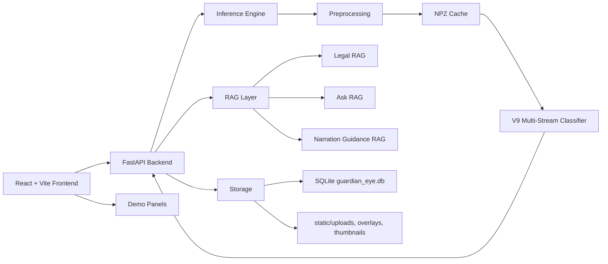

### Main Folders

- `Backend_Ashour/BackEnd`: current rich FastAPI backend, inference, RAG,
  SQLite, overlay, and tests.
- `FrontEnd`: React/Vite/TypeScript/Tailwind frontend.
- `FULL_RAG_Pipeline`: standalone RAG pipeline package, legal index code,
  legal data, tests, and docs.
- `models`: expected model storage root for V9, VideoMAE, and local LLM assets.
- `outputs`: generated presentation and validation artifacts.

### Runtime Modes

The backend supports mock and real inference:

- `GUARDIAN_MOCK=1`: deterministic mock predictions for frontend/demo stability.
- `GUARDIAN_MOCK=0`: real preprocessing and V9 classifier inference.

The frontend supports:

- `VITE_API_MODE=mock`: local mock frontend data.
- `VITE_API_MODE=auto` or backend mode: FastAPI calls through Axios.
- `VITE_API_BASE_URL`: defaults to `http://localhost:8000`.

## 3. Violence Detection Pipeline

### End-to-End Pipeline

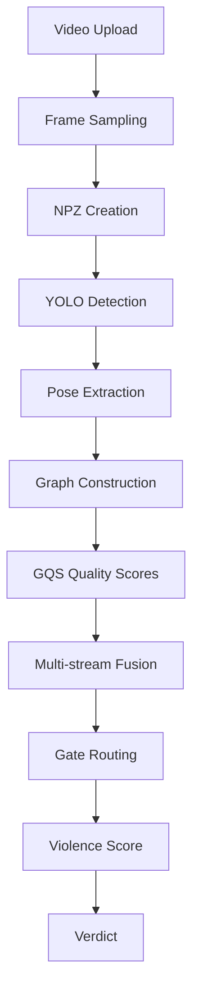

### Step-by-Step

#### 1. Video Upload

Frontend file upload is handled in:

- `FrontEnd/src/components/UploadPanel.tsx`
- `FrontEnd/src/api/guardianApi.ts::predictVideo()`

Backend upload endpoint:

- `POST /predict` in `Backend_Ashour/BackEnd/main.py`

The backend stores uploads in:

- `Backend_Ashour/BackEnd/static/uploads/`

Clip IDs are sanitized and timestamped to avoid collisions.

#### 2. Frame Sampling

Real preprocessing lives in:

- `Backend_Ashour/BackEnd/inference_preprocess.py`

Constants:

- graph frames: `T = 32`
- VideoMAE frames: `T_VIT = 16`
- max persons: `M = 6`
- max objects: `N = 8`
- COCO joints: `V = 17`
- ViT frame size: `224`

Frames are uniformly sampled from the video using `np.linspace`.

#### 3. NPZ Creation

The output file is:

- `cache_npz/<clip_id>.npz`

It stores:

- `skeleton`
- `int_nodes`
- `int_edges`
- `int_node_mask`
- `int_edge_mask`
- `obj_nodes`
- `obj_node_mask`
- `po_edges`
- `po_edge_mask`
- `gqs`
- `frames_vit`
- `vit_embedding`

The NPZ cache prevents unnecessary reprocessing unless `force_reprocess=True`.

#### 4. YOLO Detection

The preprocessing file loads:

- pose model from `GUARDIAN_YOLO_POSE_PATH`, default `yolo11x-pose.pt`
- object model from `GUARDIAN_YOLO_OBJ_PATH`, default `yolo11x.pt`

YOLO pose uses ByteTrack with `persist=True` to track people across sampled
frames.

#### 5. Pose Extraction

Pose extraction stores COCO-17 keypoints for each tracked person:

```text
skeleton shape = [T, M, V, 3]
```

Each keypoint contains normalized x, normalized y, and confidence.

The V9 model also computes bones, joint motion, and bone motion in
`inference_classifier.py::_build_batch()` by calling
`v9_model.compute_bones()`.

#### 6. Graph Construction

Guardian Eye builds three graph-like inputs:

- skeleton graph for body pose
- interaction graph for person-person relationships
- object/person-object graph for object proximity

Person interaction edges contain:

- distance
- IoU
- close flag
- relative speed

Person-object edges contain:

- wrist distance
- body distance
- IoU
- near-wrist flag
- near-body flag

#### 7. GQS

GQS means graph quality scores. It is computed during preprocessing and passed
into the classifier as a quality signal.

The fields are:

- `q_skel`: fraction of frames with enough valid pose joints
- `q_int`: fraction of frames with at least two people
- `q_obj`: fraction of frames with at least one object
- `q_po`: fraction of frames with person-object edges
- `valid_ratio`: fraction of frames with at least one valid person

GQS is important because the fusion gate uses it to weigh stream reliability.

#### 8. Multi-Stream Fusion

The V9 classifier is implemented in:

- `Backend_Ashour/BackEnd/v9_model.py`
- `Backend_Ashour/BackEnd/inference_classifier.py`

It has four streams:

1. Skeleton stream: `EnhancedSTGCN`
2. Interaction stream: `ImprovedInteraction`
3. Object stream: `ObjectPOStream`
4. ViT stream: `VitProjection`

The model fuses these streams through `QualityGatedFusion` when
`fusion_mode="qgf"`.

### Stream Diagram

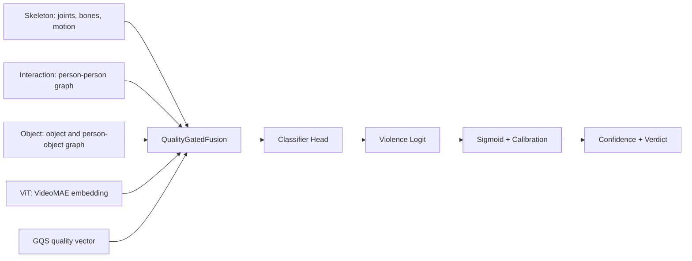

### Skeleton Stream

The skeleton stream uses an enhanced ST-GCN over COCO-17 joints. It receives a
multi-input skeleton tensor made from:

- joints
- bones
- joint motion
- bone motion

This stream captures body pose and movement.

### Interaction Stream

The interaction stream uses GATv2-style graph layers plus a temporal transformer.
It receives person nodes and person-person edges. It captures whether people
are close, moving toward each other, overlapping, or changing speed relative to
each other.

### Object Stream

The object stream uses frame-level graph processing and temporal GRUs over
object nodes and person-object edges. It captures whether objects are near
people or wrists.

Important presentation point: an object proximity flag is not proof of weapon
use. The system treats it as a cue for review.

### ViT Stream

The ViT stream uses a VideoMAE embedding:

- default checkpoint env: `GUARDIAN_VIDEOMAE_CKPT`
- embedding dimension: `768`

If VideoMAE is missing, preprocessing stores a zero vector. The backend exposes
inactive stream diagnostics so the UI does not over-interpret a missing ViT
stream.

### Gate Weights

Gate weights come from `QualityGatedFusion`. They show how much each stream
contributed to the fused classifier embedding for this clip.

The API returns:

```json
{
  "gate": {
    "skeleton": 0.34,
    "interaction": 0.41,
    "object": 0.07,
    "vit": 0.18
  }
}
```

The frontend renders these in:

- `FrontEnd/src/components/GateBar.tsx`

Gate validity is checked in `inference_classifier.py::_modality_activity()`.
If a modality is zero-filled or missing, the API returns:

- `active_modalities`
- `inactive_modalities`
- `gate_validity`

### Confidence and Threshold

The classifier outputs a logit. In `classifier_forward()`:

1. Apply sigmoid to get raw probability.
2. Apply optional temperature calibration with `GUARDIAN_CAL_TEMP`.
3. Compare confidence against threshold.

Threshold comes from:

- `GUARDIAN_THRESHOLD`, if provided
- checkpoint `threshold`, if present
- default `0.28` in real classifier module

Mock examples often use `0.51` as the demo threshold.

The verdict is:

```text
violence if confidence >= threshold
non-violence otherwise
```

## 4. Demo Features

### Feature Map

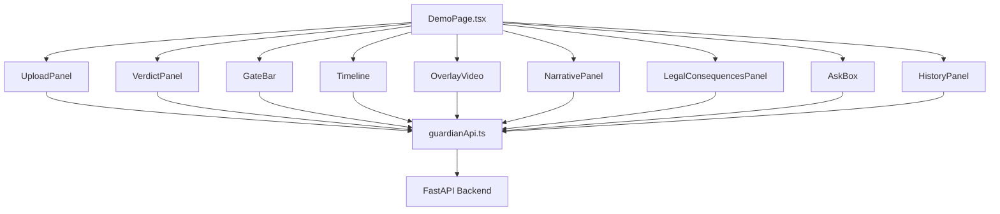

### Upload

Purpose: send a user video to the backend and start analysis.

Backend endpoint: `POST /predict`

Backend files:

- `Backend_Ashour/BackEnd/main.py`
- `Backend_Ashour/BackEnd/model_service.py`
- `Backend_Ashour/BackEnd/inference_preprocess.py`
- `Backend_Ashour/BackEnd/inference_classifier.py`

Frontend files:

- `FrontEnd/src/components/UploadPanel.tsx`
- `FrontEnd/src/api/guardianApi.ts`
- `FrontEnd/src/pages/DemoPage.tsx`

Data flow:

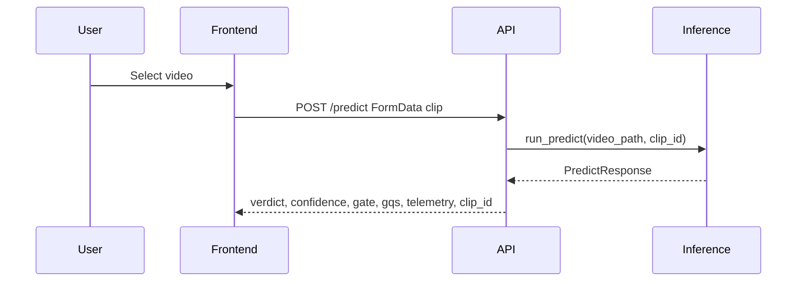

### Prediction

Purpose: classify the uploaded clip as violence or non-violence.

Endpoint: `POST /predict`

Response schema: `PredictResponse` in `Backend_Ashour/BackEnd/schemas.py`

Frontend type: `GuardianPrediction` in `FrontEnd/src/types/guardian.ts`

### Verdict

Purpose: show the final model decision.

Backend field:

- `verdict`

Frontend file:

- `FrontEnd/src/components/VerdictPanel.tsx`

### Confidence

Purpose: show calibrated model confidence.

Backend fields:

- `confidence`
- `threshold`

Frontend files:

- `VerdictPanel.tsx`
- `guardianApi.ts`

### Gate Contributions

Purpose: explain which model streams drove the decision.

Backend fields:

- `gate`
- `active_modalities`
- `inactive_modalities`
- `gate_validity`

Frontend file:

- `FrontEnd/src/components/GateBar.tsx`

### Timeline

Purpose: show peak activity window.

Backend field:

- `telemetry.peak_window`

Backend computation:

- `inference_classifier.py::_derive_telemetry()`

Frontend file:

- `FrontEnd/src/components/Timeline.tsx`

### Peak Window

Purpose: identify the highest-activity frame window.

In real inference, the peak window is a 4-frame window over close interaction
flags. It is not a confirmed incident start/end time.

### Overlay Viewer

Purpose: show original/overlay video and per-stream overlays.

Backend endpoint:

- `POST /overlay`

Backend files:

- `Backend_Ashour/BackEnd/main.py`
- `Backend_Ashour/BackEnd/overlay_service.py`

Frontend file:

- `FrontEnd/src/components/OverlayVideo.tsx`

Data flow:

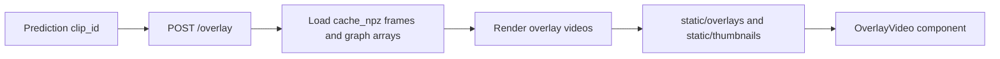

### Narration

Purpose: explain the prediction in human-readable language.

Backend endpoint:

- `POST /explain`

Backend files:

- `Backend_Ashour/BackEnd/explanation_service.py`
- `Backend_Ashour/BackEnd/narration_service.py`

Frontend file:

- `FrontEnd/src/components/NarrativePanel.tsx`

### Legal Consequences

Purpose: show jurisdiction-specific possible legal context.

Backend endpoints:

- `POST /explain`
- `POST /legal-consequences`

Backend files:

- `Backend_Ashour/BackEnd/services/rag_adapter.py`
- `Backend_Ashour/BackEnd/services/curated_legal_service.py`
- `FULL_RAG_Pipeline/rag_service/*`

Frontend files:

- `FrontEnd/src/components/CountrySelector.tsx`
- `FrontEnd/src/components/LegalConsequencesPanel.tsx`

### Ask Guardian Eye

Purpose: answer questions about the current incident, history, reference
guidance, or legal context.

Endpoint:

- `POST /ask`

Backend files:

- `Backend_Ashour/BackEnd/ask_rag_service.py`
- `Backend_Ashour/BackEnd/incident_memory_service.py`
- `Backend_Ashour/BackEnd/explanation_service.py`

Frontend file:

- `FrontEnd/src/components/AskBox.tsx`

### History

Purpose: review saved incidents.

Endpoints:

- `GET /history`
- `GET /incident/{incident_id}`

Backend files:

- `Backend_Ashour/BackEnd/database.py`
- `Backend_Ashour/BackEnd/incident_service.py`
- `Backend_Ashour/BackEnd/main.py`

Frontend file:

- `FrontEnd/src/components/HistoryPanel.tsx`

Incidents are saved after `/explain`, not immediately after `/predict`.

## 5. Narration System

### Narration Diagram

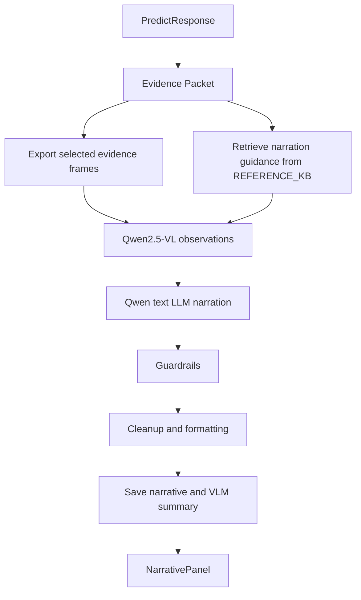

### VLM

The VLM is used after prediction, not during `/predict`. This avoids slowing
the upload-to-verdict path.

Default VLM:

- `Qwen/Qwen2.5-VL-3B-Instruct-AWQ`

Override:

- `GUARDIAN_VLM_MODEL_ID`

### LLM

The text LLM turns visual observations plus the evidence packet into final
narration.

Default LLM:

- `Qwen/Qwen2.5-3B-Instruct-AWQ`

Override:

- `GUARDIAN_LLM_MODEL_ID`

### Grounding

Grounding comes from:

- classifier verdict
- confidence
- threshold
- gate weights
- GQS
- people count
- peak window
- weapon/object proximity
- selected evidence frames
- narration guidance context

### Guardrails

Guardrails prevent:

- reclassifying the clip
- contradicting the classifier verdict
- attacker/victim role assignment
- legal responsibility claims
- filenames and internal prompt artifacts
- unsafe person descriptions

### Translation

The `/explain` request supports:

- `language: "en"`
- `language: "ar"`

Arabic output uses language guidance and polishing from
`Backend_Ashour/BackEnd/text_quality.py`.

### Fallbacks

Fallback narration is deterministic and uses classifier outputs. The response
exposes:

- `narration_mode`
- `model_status`
- `reason_if_fallback`

## 6. Legal Consequences System

### Diagram

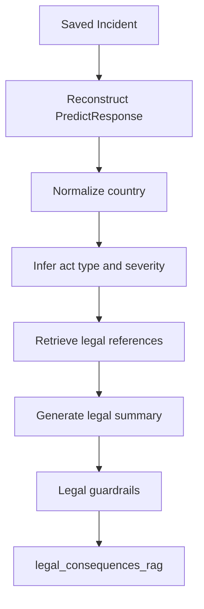

### Explanation

Legal Consequences RAG is called during `/explain` or through
`/legal-consequences`. It uses the selected country and prediction facts to
retrieve legal references and generate a cautious summary.

It supports:

- Canada
- UK
- USA California
- UAE
- KSA
- Egypt

It rejects unsupported countries with a clear fallback warning.

## 7. Ask Guardian Eye System

### Diagram

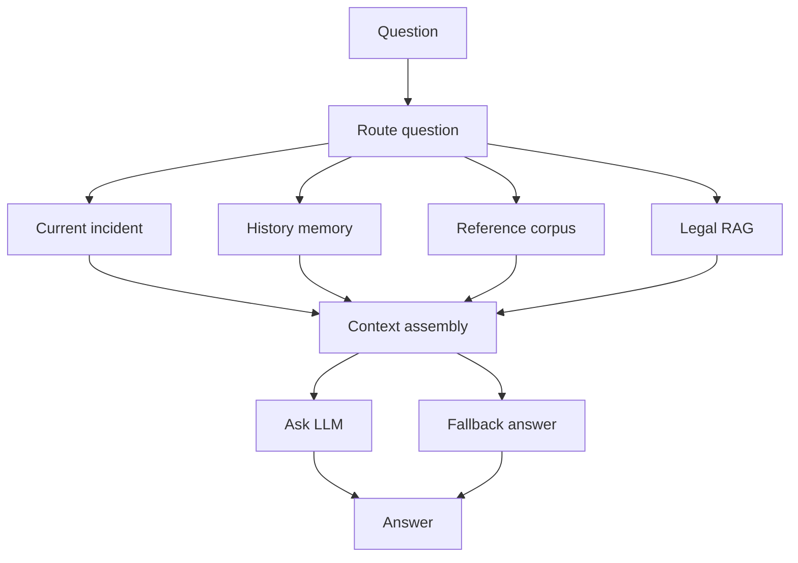

Ask routes questions into:

- current incident questions
- history/memory questions
- general system/reference questions
- legal questions

Historical memory uses a local JSON vector cache with hashed lexical
embeddings. It is CPU-safe for the demo.

## 8. Frontend Architecture

### Stack

- React 19
- Vite 8
- TypeScript
- Tailwind CSS 4
- shadcn-style UI components
- lucide-react icons
- Axios

### Component Hierarchy

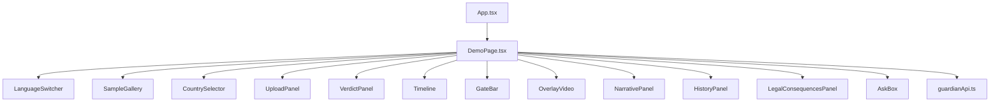

### API Boundary

All backend calls are centralized in:

- `FrontEnd/src/api/guardianApi.ts`

This file normalizes FastAPI responses into frontend-friendly types from:

- `FrontEnd/src/types/guardian.ts`

## 9. Backend Architecture

### Backend Diagram

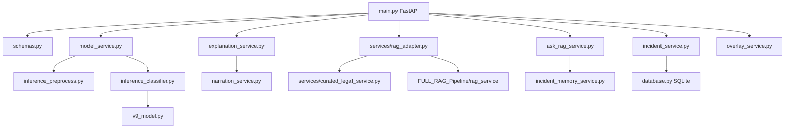

### FastAPI

The app is created in `Backend_Ashour/BackEnd/main.py`. It mounts `/static`,
enables CORS, creates tables on startup, optionally seeds demo incidents, and
loads the real classifier when `GUARDIAN_MOCK=0`.

### Services

- `model_service.py`: mock or real prediction entrypoint
- `inference_preprocess.py`: video to NPZ
- `inference_classifier.py`: V9 model forward pass
- `overlay_service.py`: overlay and thumbnail rendering
- `explanation_service.py`: explanation and fallback QA helpers
- `narration_service.py`: VLM/LLM grounded narration
- `ask_rag_service.py`: Ask Guardian Eye routing and LLM
- `incident_memory_service.py`: local vector incident memory
- `services/rag_adapter.py`: Legal RAG adapter and `/explain` RAG enrichment
- `services/curated_legal_service.py`: curated legal fallback and legal LLM
- `incident_service.py`: save/query incidents
- `database.py`: SQLAlchemy SQLite schema

### Storage

The backend stores:

- uploaded clips in `static/uploads`
- overlays in `static/overlays`
- thumbnails in `static/thumbnails`
- SQLite DB in `db/guardian_eye.db`
- incident memory vector cache in `db/incident_memory_store.json`
- NPZ preprocessing cache in `cache_npz`

## 10. API Reference

### POST /predict

Purpose: upload a video and run violence prediction.

Input: multipart form data

- `clip`: video file
- `clip_id`: optional requested ID

Output:

- `verdict`
- `confidence`
- `threshold`
- `gate`
- `active_modalities`
- `inactive_modalities`
- `gate_validity`
- `gqs`
- `telemetry`
- `clip_id`
- `source`
- `model_route`

Example:

```http
POST /predict
Content-Type: multipart/form-data

clip=@fight_1.avi
clip_id=fight_1.avi
```

### POST /explain

Purpose: generate narration, overlays, RAG enrichment, and save the incident.

Input:

```json
{
  "clip_id": "fight_1_20260615_143813_777527_fbc2495f.avi",
  "language": "en",
  "country": "Canada"
}
```

Output:

- `narrative`
- `incident_id`
- `language`
- `narration_mode`
- `model_status`
- `reason_if_fallback`
- `explanation_rag`
- `incident_memory_rag`
- `legal_consequences_rag`
- `legal_scores`

### POST /legal-consequences

Purpose: generate or refresh legal consequence RAG for a saved incident.

Input:

```json
{
  "incident_id": "uuid",
  "clip_id": null,
  "country": "Canada",
  "language": "en"
}
```

Output:

- `legal_consequences_rag`
- `legal_scores`
- `language`

### POST /ask

Purpose: answer natural-language questions about the current incident, history,
system reference guidance, or legal context.

Input:

```json
{
  "question": "Why was this classified as violent?",
  "language": "en",
  "clip_id": "fight_1.avi",
  "incident_id": "uuid",
  "country": "Canada"
}
```

Output:

- `answer`
- `incidents`
- `language`
- `ask_mode`
- `selected_route`
- `retrieved_context_count`
- `reason_if_fallback`
- `vlm_summary_used`
- `summary_source`
- `vlm_people_count`
- `vlm_violence_type`

### GET /history

Purpose: query saved incidents.

Query parameters:

- `verdict`
- `weapon`
- `min_confidence`
- `free_text`
- `from`
- `to`
- `limit`
- `offset`

Output:

- `total`
- `incidents`

### POST /overlay

Purpose: render or reuse overlay videos for a clip.

Input: multipart form data

- `clip_id`

Output:

- `clip_id`
- `overlay_url`
- `overlay_path`
- `thumbnail_path`
- `overlays`
- `overlay_status`

### GET /incident/{incident_id}

Purpose: fetch a single saved incident with full review data.

Output includes:

- prediction fields
- upload path
- overlay paths
- packet summary
- narrative
- model route diagnostics

### GET /health

Purpose: check backend availability and mode.

Output:

- `status`
- `mock_mode`
- `phase`

## 11. Demo Walkthrough

### Step 1: Introduce the System

What to say:

Guardian Eye is an AI-powered video intelligence system. It does not only say
violence or non-violence; it shows the evidence path behind the decision,
generates a safe narration, retrieves legal context, answers questions, and
saves incidents for history review.

Internally:

Frontend is loaded from React/Vite. It checks `/health` and loads sample data
or connects to the backend depending on `VITE_API_MODE`.

### Step 2: Select Country

What to say:

The legal system is jurisdiction-specific, so we select a supported country
before asking for legal consequences. Unsupported countries are intentionally
not used to avoid hallucinated law.

Internally:

`CountrySelector.tsx` sets country state. `/explain`, `/legal-consequences`,
and `/ask` receive the selected country.

### Step 3: Upload Video

What to say:

The video is uploaded to FastAPI. The backend stores it and returns a stable
clip ID for the rest of the pipeline.

Internally:

`predictVideo()` posts FormData to `/predict`. Backend writes to
`static/uploads`.

### Step 4: Explain Inference

What to say:

In real mode, the backend samples frames, runs YOLO pose/object detection, forms
graphs, computes GQS, extracts VideoMAE features, and runs the V9 classifier.

Internally:

`model_service.run_predict()` calls preprocessing and classifier forward.

### Step 5: Show Verdict and Confidence

What to say:

The model outputs a calibrated confidence and compares it to a threshold. If the
confidence is above threshold, the verdict is violence.

Internally:

`classifier_forward()` applies sigmoid, calibration, and threshold comparison.

### Step 6: Show Gate Contributions

What to say:

The gate weights explain which stream contributed most: skeleton, interaction,
object, or ViT. If a stream was unavailable, the UI warns us not to treat its
gate percentage as valid evidence.

Internally:

V9 returns gates from `QualityGatedFusion`; `_modality_activity()` checks for
zero-filled streams.

### Step 7: Show Timeline and Overlay

What to say:

The peak window is the highest-activity window in the sampled frames. The
overlay helps visually inspect skeletons, interactions, objects, and ViT frame
context.

Internally:

`/overlay` renders output with `overlay_service.py`.

### Step 8: Show Narration

What to say:

The narration is grounded. The LLM cannot reclassify the clip, cannot call
someone attacker or victim, and cannot decide guilt.

Internally:

`/explain` calls narration guidance retrieval, VLM observations, LLM narration,
guardrails, cleanup, and fallback if needed.

### Step 9: Show Legal Consequences

What to say:

Legal RAG retrieves country-specific legal context. It provides possible
consequences with citations and clear limitations. It is not legal advice.

Internally:

`build_legal_response()` retrieves metadata rows or curated legal records and
optionally calls a legal LLM.

### Step 10: Ask Guardian Eye

What to say:

The assistant can answer about the current video, historical incidents, stream
contributions, people count, or legal context. It uses retrieved context rather
than inventing answers.

Internally:

`/ask` routes the question, retrieves context, calls the Ask LLM if available,
and falls back deterministically if not.

### Step 11: Review History

What to say:

Once explanation completes, the incident is saved in SQLite and can be reviewed
later with all supporting data.

Internally:

`save_incident()` writes one row to `guardian_eye.db`. `GET /history` and
`GET /incident/{id}` load it.

## 12. Common Questions and Answers

### Why use GQS?

GQS tells the model and presenter how reliable the graph evidence is. A
skeleton stream with poor joints should not be trusted the same way as a clean
skeleton stream. Guardian Eye computes `q_skel`, `q_int`, `q_obj`, `q_po`, and
`valid_ratio`, then uses these quality scores in fusion and exposes them in the
API.

### Why use ViT or VideoMAE?

The graph streams capture pose, interaction, and object relationships. The ViT
stream adds global visual context from RGB frames. This helps when motion or
scene appearance matters beyond detected keypoints. If the VideoMAE checkpoint
is missing, the system zero-fills the embedding and reports the stream as
inactive.

### Why use gate fusion?

Different videos have different reliable signals. In one clip, person-person
interaction may dominate. In another, skeleton motion or object proximity may
be more informative. Quality-gated fusion lets the model adapt stream weights
instead of using a fixed average.

### Why use RAG?

RAG keeps language output grounded. Legal answers come from curated or indexed
legal context. Ask answers come from saved incidents and retrieved context.
Narration retrieves safety guidance so the VLM/LLM does not overclaim.

### Why not pure LLM?

A pure LLM could hallucinate law, reclassify the video, invent injuries, assign
attacker/victim roles, or produce unsupported claims. Guardian Eye uses the LLM
only after prediction and wraps it with evidence packets, retrieved context, and
guardrails.

### How do you prevent hallucinations?

The system prevents hallucinations by:

- treating classifier verdict as final
- building deterministic evidence packets
- retrieving only supported country legal references
- hard-filtering legal retrieval by country
- using guardrails for legal and narration text
- falling back when models fail
- exposing warnings and fallback reasons
- preventing attacker/victim/guilt/court outcome claims

### How do you support Arabic?

The backend schemas accept `language: "ar"` for `/explain`, `/ask`, and legal
requests. Text generation includes Arabic-only instructions, Arabic labels, and
polishing/validation in `text_quality.py`. Legal and narration fallbacks also
contain Arabic-safe paths.

### Why are incidents saved after /explain, not /predict?

The saved incident is meant to include prediction, overlay paths, narrative,
packet summary, VLM summary, and RAG context. `/predict` only knows the
classifier result. `/explain` completes the review packet and then persists it.

### Can Guardian Eye identify who started the fight?

No. The system intentionally avoids that. It may describe visible people and
actions cautiously, but it does not assign attacker, victim, initiator, guilt,
or legal responsibility.

### Is the legal output legal advice?

No. The output is jurisdiction-specific context for review. It includes
limitations and never determines guilt, exact penalty, or court outcome.

### What happens if a model is unavailable?

The system falls back. Prediction has mock mode. Narration falls back to
deterministic classifier-based text. Legal falls back to curated summaries or
warnings. Ask falls back to deterministic answers from saved records.

### Why not run the VLM inside /predict?

`/predict` should remain fast and focused on classification. VLM loading is
expensive and can consume GPU memory. Guardian Eye runs VLM narration after
prediction during `/explain`, where latency is more acceptable.

### What is the difference between evidence and guidance?

Evidence is data from the current video and classifier: frames, verdict,
confidence, gates, GQS, people count, peak window, and object proximity.
Guidance is retrieved text that constrains how the system explains evidence,
for example "do not reclassify" or "do not identify attacker/victim roles."

## 13. Future Work

### Model Improvements

- Expand training datasets.
- Improve calibration per dataset.
- Add more robust VideoMAE checkpoints.
- Add model uncertainty estimation.
- Improve dataset router validation.

### RAG Improvements

- Expand legal sources and jurisdictions.
- Replace local Ask memory JSON with Chroma or FAISS for larger deployments.
- Add explicit citations in Ask answers.
- Log retrieved context for every generated response.
- Add human review workflow for legal chunks.

### Frontend Improvements

- Add side-by-side stream overlays.
- Add detailed model-route diagnostics panel.
- Add downloadable incident report.
- Add examiner mode that reveals pipeline internals step-by-step.
- Add richer Arabic UI copy and RTL QA.

### Backend Improvements

- Add authentication for real deployments.
- Add async background jobs for long VLM/LLM tasks.
- Add persistent job status for overlays and narration.
- Add API-level audit logs.
- Add cloud/object storage option for videos and overlays.

### Deployment Improvements

- Package backend and frontend with reproducible environment scripts.
- Add GPU health checks.
- Add model artifact validation before startup.
- Add Docker or Windows launch profiles for presentation day.

## Presentation Closing

Guardian Eye is not just a classifier. It is a complete video intelligence
workflow: graph-based visual inference, quality-gated multi-stream fusion,
grounded narration, legal-context retrieval, natural-language incident Q&A, and
history review. The most important design principle is that every generated
answer is bounded by evidence, retrieval, and explicit safety limits.
