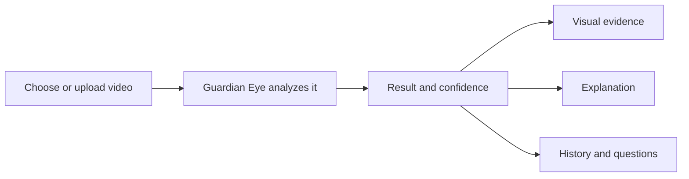
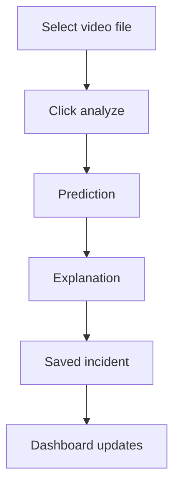
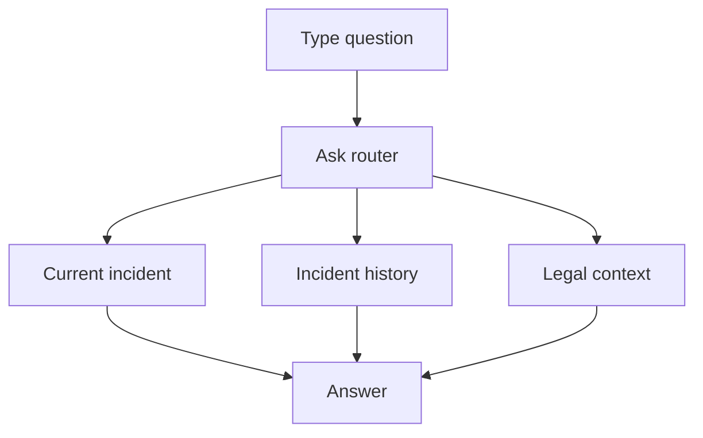

# Guardian Eye Non-Technical User Guide

## Table of Contents

1. [What Guardian Eye Does](#what-guardian-eye-does)
2. [Before You Start](#before-you-start)
3. [Opening the Demo](#opening-the-demo)
4. [Using a Sample Video](#using-a-sample-video)
5. [Uploading Your Own Video](#uploading-your-own-video)
6. [Reading the Results](#reading-the-results)
7. [Understanding the Visual Overlays](#understanding-the-visual-overlays)
8. [Using the Legal Consequences Panel](#using-the-legal-consequences-panel)
9. [Asking Questions](#asking-questions)
10. [Reviewing Incident History](#reviewing-incident-history)
11. [What to Trust and What Not to Overclaim](#what-to-trust-and-what-not-to-overclaim)
12. [Common Problems](#common-problems)
13. [Suggested Defense Demo Script](#suggested-defense-demo-script)

## What Guardian Eye Does

Guardian Eye is a demo system that analyzes short video clips and reports whether the clip appears to contain violence or non-violence. It also explains which evidence streams influenced the result and can show visual overlays such as skeletons, interaction cues, objects, and raw appearance frames.

It is important to understand that Guardian Eye is a decision-support demo. It does not prove guilt, identify an attacker, identify a victim, replace human review, or provide legal advice.

## Before You Start

Make sure:

- The backend terminal is running.
- The frontend terminal is running.
- The frontend page shows that the backend is connected, unless you intentionally use mock mode.
- The video is short enough for the demo machine to process.
- If you want legal consequences, choose a country before or after analysis.

## Opening the Demo

After the frontend starts, open the local Vite URL shown in the terminal. The page begins with a splash screen, then opens the Guardian Eye dashboard.

The top area shows:

- Demo mode banner.
- Backend status.
- Language switcher.
- General system status.

If the backend is unavailable, sample data may still appear, but uploaded video analysis will not run correctly.

## Using a Sample Video

The easiest demo path is:

1. Select one of the sample videos.
2. Wait for the dashboard panels to update.
3. Read the verdict, confidence, timeline, gate contributions, overlay streams, narrative, legal panel, and history.

Samples are useful during a thesis defense because they avoid waiting for a full video preprocessing run.

## Uploading Your Own Video

To analyze a custom clip:

1. Go to the upload panel.
2. Choose a video file.
3. Press the analyze button.
4. Wait until analysis completes.

The system may take time because it can run pose detection, object detection, VideoMAE embedding, classifier inference, overlay rendering, and explanation generation.

If an expensive model cannot load, Guardian Eye should still return a safe fallback result instead of failing the demo.

## Reading the Results

### Verdict

The verdict panel shows:

- `Violence detected`, or
- `Non-violence`.

### Confidence

Confidence is the model score displayed as a percentage. A violence result can appear even when the confidence looks moderate, because the backend compares the confidence against a trained threshold. For example, if the threshold is lower than 50 percent, a score below 50 percent can still be classified as violence. This is a calibration and threshold issue, not a frontend display bug.

### Gate Contributions

The gate bar shows how much each model stream contributed:

- Skeleton stream.
- Interaction stream.
- Object stream.
- ViT/RGB stream.

If a stream was missing or zero-filled, the interface may mark the gate evidence as partial. This is useful because it tells the viewer not to treat that stream as strong evidence.

### Timeline

The timeline highlights the peak activity window. This is a model-derived timing cue, not a legal conclusion.

## Understanding the Visual Overlays

The overlay panel can show four streams:

| Stream | Meaning |
|---|---|
| Skeleton | Body pose lines and joints |
| Interaction | Person boxes and relationship cues |
| Object | Object boxes and person-object cues |
| ViT/RGB | Raw visual appearance stream |

Some streams may show as pending, missing, or fallback placeholders. That means the backend did not return that specific stream for the current video. It does not necessarily mean the prediction is invalid, but it does mean that stream should not be overinterpreted.

## Using the Legal Consequences Panel

The legal panel is optional. To use it:

1. Select a country.
2. Analyze a video or choose a sample.
3. Read the legal summary and references.

The legal output is cautious. It does not say who is guilty, who attacked whom, or what a court will decide. It only gives a possible legal consequence summary based on the selected country and curated demo references.

If the video is classified as non-violent, the panel should say that no legal consequences are suggested.

If no country is selected, the panel will ask you to choose one.

## Asking Questions

Use the Ask Guardian Eye box for questions such as:

- Why was this classified as violence?
- Which stream contributed most?
- Was there a weapon or object flag?
- How many people were tracked?
- Are there similar previous incidents?
- What are the possible legal consequences in the selected country?

Guardian Eye answers from saved context and retrieved records. If the language model cannot load, it returns a simpler fallback answer.

## Reviewing Incident History

The history panel lists saved incidents. Click an incident to reload its review.

History usually includes:

- Clip name.
- Time saved.
- Verdict.
- Confidence.
- Thumbnail when available.
- Narrative when available.

An incident is saved after the explanation step finishes. If only `/predict` runs and explanation is skipped, the incident may not appear in full history.

## What to Trust and What Not to Overclaim

You can trust Guardian Eye to display the backend result and available metadata honestly.

You should not claim:

- The system proves a crime.
- The system identifies guilt.
- The system identifies attacker or victim roles with certainty.
- The legal panel is legal advice.
- Missing overlay streams mean the event did not happen.
- A generated explanation is stronger evidence than the classifier output.

The safest explanation is: Guardian Eye provides an AI-assisted analysis of a video clip, including a model verdict, confidence, evidence streams, and cautious retrieval-based context for human review.

## Common Problems

| Problem | Meaning | What to do |
|---|---|---|
| Backend unavailable | Frontend cannot reach FastAPI | Check backend terminal and URL |
| Video analysis failed | Upload or backend processing failed | Try a shorter clip or restart backend |
| Legal panel asks for country | Country was not selected | Select a supported country |
| Legal mode says curated fallback | Legal LLM could not run or was disabled | This is expected on limited machines |
| Ask answer says fallback | Ask LLM could not run | Use the answer as a simple context response |
| ViT stream inactive | VideoMAE checkpoint missing or zero embedding used | Do not overinterpret ViT gate contribution |
| Narration fallback | VLM or LLM could not load | Use classifier packet explanation |
| Moderate confidence but violence verdict | Threshold is lower than the displayed confidence value | Explain threshold calibration |

## Suggested Defense Demo Script

1. Open Guardian Eye and show that the dashboard is connected.
2. Select a sample video to get a fast result.
3. Point to the verdict and confidence.
4. Explain that the confidence is compared with a trained threshold.
5. Show the gate bar and mention the four model streams.
6. Play the overlay streams and point out skeleton, interaction, object, and RGB views.
7. Show the narrative and explain that it must follow the classifier verdict.
8. Select a country and show the legal panel.
9. Ask a question such as "Why was this classified as violence?"
10. Open a history item and show that Guardian Eye can review saved incidents.
11. Mention that expensive VLM routing is not used during `/predict`; the demo uses a lightweight rule-based router for checkpoint selection.
