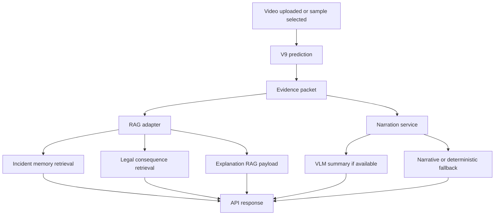
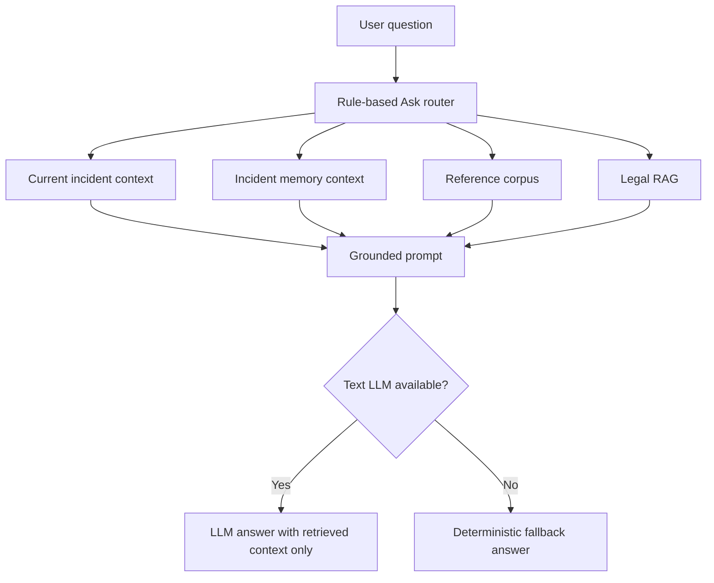
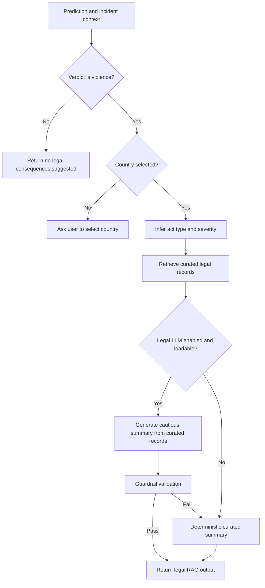
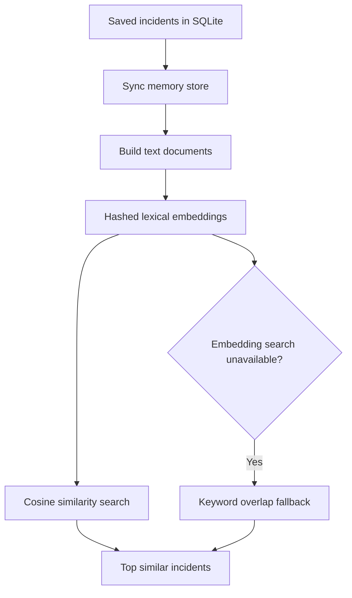
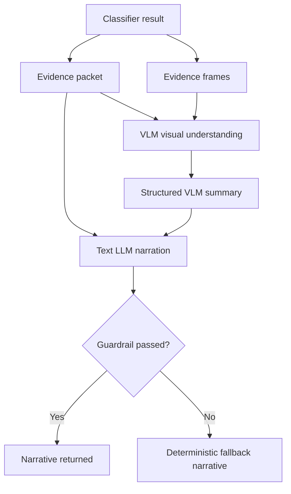

# Guardian Eye RAG Pipeline README

## Table of Contents

1. [Purpose](#purpose)
2. [RAG Components](#rag-components)
3. [Runtime Workflow](#runtime-workflow)
4. [Ask Guardian Eye RAG](#ask-guardian-eye-rag)
5. [Legal Consequences RAG](#legal-consequences-rag)
6. [Incident Memory RAG](#incident-memory-rag)
7. [Reference and Explanation RAG](#reference-and-explanation-rag)
8. [VLM and LLM Narration Layer](#vlm-and-llm-narration-layer)
9. [Prompting and Guardrails](#prompting-and-guardrails)
10. [Technology Stack](#technology-stack)
11. [Fallback Modes and Limitations](#fallback-modes-and-limitations)
12. [Testing and Validation](#testing-and-validation)

## Purpose

This document describes the Retrieval-Augmented Generation (RAG) design used in the Guardian Eye demo system. The objective of the RAG layer is not to classify violence. Classification remains the responsibility of the V9 multimodal classifier. The RAG layer explains, contextualizes, retrieves related incidents, and produces cautious legal consequence summaries using retrieved context and explicit safety rules.

Guardian Eye uses a hybrid RAG design:

- Classifier outputs provide the authoritative verdict, confidence, gate weights, quality scores, and telemetry.
- Retrieval components gather related evidence from the current incident, previous incident history, curated legal context, and reference material.
- Language models are used only when available and safe to load on the demo machine.
- Deterministic fallbacks preserve demo continuity when GPU memory, virtual memory, model files, or guardrails prevent generation.

## RAG Components

| Component | Main files | Retrieval source | Generation mode | Purpose |
|---|---|---|---|---|
| Ask Guardian Eye RAG | `Backend_Ashour/BackEnd/ask_rag_service.py` | Current incident, incident memory, reference corpus, legal context | Qwen text LLM or deterministic fallback | Answer user questions about the current clip and prior incidents |
| Legal Consequences RAG | `Backend_Ashour/BackEnd/services/curated_legal_service.py` | Curated local legal knowledge base | Qwen text LLM or curated fallback | Produce cautious country-specific legal consequence summaries |
| Incident Memory RAG | `Backend_Ashour/BackEnd/incident_memory_service.py` | SQLite incidents plus JSON vector cache | Retrieval only | Find similar previous incidents using local hashed lexical embeddings |
| Explanation RAG adapter | `Backend_Ashour/BackEnd/services/rag_adapter.py` | Prediction packet, memory, legal service | Mostly deterministic adapter | Combine explanation, memory, and legal outputs for the API |
| Reference corpus RAG | `FULL_RAG_Pipeline/g2_reference_store.py` and `reference_corpus` | Text reference corpus and optional FAISS store | Retrieval snippets | Provide terminology and caveats for narration |
| VLM incident understanding | `Backend_Ashour/BackEnd/narration_service.py` | Evidence frames and classifier packet | Qwen2.5-VL plus Qwen text LLM, or fallback | Produce visual summary and narrative grounded in classifier results |

## Runtime Workflow

The RAG layer begins after the model prediction has already been produced. This separation is important: retrieved context may explain a decision, but it does not override the classifier verdict.

## Ask Guardian Eye RAG

The Ask RAG service answers free-form questions from the frontend Ask box. It is designed as a router over several context sources rather than a single monolithic prompt.

### Inputs

| Input | Description |
|---|---|
| `question` | User question in English or Arabic |
| `clip_id` | Optional current clip handle |
| `incident_id` | Optional saved incident id |
| `country` | Optional country for legal questions |
| `language` | Frontend language selection |

### Retrieval Routes

| Route | When selected | Retrieved context |
|---|---|---|
| `current_incident` | Questions about the current result, verdict, confidence, stream weights, people, weapons, or timing | Saved current incident and classifier telemetry |
| `history_memory` | Questions about previous, similar, repeated, or historical incidents | Incident Memory RAG results |
| `reference_corpus` | Questions about terminology, meaning, or evidence interpretation | Local reference corpus snippets |
| `legal_rag` | Questions about laws, consequences, country-specific review, or penalties | Curated Legal RAG output |

### Answer Generation

If the Qwen text LLM is available, the system builds a prompt with retrieved context only. The prompt instructs the model not to invent facts outside the retrieved context. If the LLM cannot load, returns empty text, fails Arabic validation, or violates constraints, the service returns a deterministic fallback response based on saved incident fields.

The Ask service exposes metadata such as:

- `ask_mode`: `llm` or `fallback`.
- `selected_route`: selected retrieval route.
- `retrieved_context_count`: number of retrieved context items.
- `reason_if_fallback`: reason the fallback was used.
- VLM summary fields when available.

## Legal Consequences RAG

The legal pipeline is curated, local, and intentionally cautious. It is not a legal advice engine and does not determine guilt, intent, identities, or court outcome.

### Supported Countries

The curated knowledge base supports:

- Canada
- UK
- USA California
- UAE
- KSA
- Egypt

### Legal Workflow

### Retrieval Basis

The legal retriever does not scrape live websites during the demo. It uses curated records embedded in `curated_legal_service.py`. Retrieval is based on:

- Selected country.
- Classifier verdict.
- Weapon or object flag.
- Inferred act type such as `violent_conduct` or `weapon_or_dangerous_object`.
- Inferred severity using classifier confidence, telemetry, and VLM summary if available.

### Legal Generation Rules

The Legal RAG prompt requires:

- Use retrieved curated legal context only.
- Do not identify attacker or victim.
- Do not determine guilt, intent, responsibility, legal certainty, exact penalties, or court outcome.
- Include cautious language such as "If responsibility is confirmed by authorities".
- Include a disclaimer that the output is not legal advice.
- Avoid repeating the incident narration.

## Incident Memory RAG

Incident Memory RAG retrieves similar previous incidents from saved demo records.

### Storage Design

| Storage | Location | Purpose |
|---|---|---|
| SQLite incident table | `Backend_Ashour/BackEnd/db/guardian_eye.db` at runtime | Authoritative saved incident records |
| JSON memory cache | `Backend_Ashour/BackEnd/db/incident_memory_store.json` at runtime | Rebuilt searchable memory documents |
| Hashed lexical embedding | Computed in `incident_memory_service.py` | CPU-only similarity retrieval |

The incident memory embeddings are deterministic hashed lexical vectors. They do not require a transformer model, GPU memory, or network access. This is deliberate for demo reliability.

### Similarity Signals

Similarity is computed from:

- Verdict and confidence.
- Number of tracked people.
- Peak activity window.
- Weapon or object flags.
- Gate weights.
- Evidence packet.
- Saved narrative.

Metadata boosts are applied for violence, non-violence, weapon, and history-related questions.

## Reference and Explanation RAG

The historical `FULL_RAG_Pipeline` directory contains a fuller RAG research implementation with reference stores, legal indexing, FAISS data files, bilingual components, tests, and technical documentation. The backend demo uses a pragmatic adapter:

- Explanation RAG uses classifier evidence and deterministic explanation structures.
- Incident Memory RAG uses saved incidents from the local database.
- Legal Consequences RAG prioritizes the curated local legal service.
- Legacy FAISS and full legal pipeline code remains available for thesis context and future expansion.

The current demo therefore combines research-grade RAG assets with a safer demo-oriented execution path.

## VLM and LLM Narration Layer

The narration layer is separate from dataset routing. It is used after prediction and explanation, not inside `/predict`.

### VLM Role

Qwen2.5-VL is used for visual incident understanding when the machine can load it. It receives selected evidence frames and a classifier evidence packet. It may produce structured fields such as:

- `people_count`
- `observed_actions`
- `objects`
- `possible_roles`
- `violence_type`
- `severity_estimate`
- `environment`
- `visual_summary`
- `summary_source`

### Text LLM Role

The text LLM turns the evidence packet and VLM observations into a short user-facing narrative. It must respect the classifier verdict and may not reclassify the video.

### Why VLM Routing Is Not Used

The existing Qwen2.5-VL model can provide visual summaries, but using it for dataset routing inside `/predict` would add substantial latency and GPU memory pressure. The system therefore keeps VLM routing disabled and future-only. Dataset routing is performed by a lightweight OpenCV rule-based router.

## Prompting and Guardrails

| Technique | Used in Guardian Eye | Purpose |
|---|---:|---|
| Role prompting | Yes | Define narrator, legal assistant, or Ask assistant roles |
| System instruction prompting | Yes | Enforce boundaries and output rules |
| Retrieval-grounded prompting | Yes | Require answers from retrieved context only |
| Structured JSON context | Yes | Pass classifier, VLM, and legal facts in machine-readable form |
| Zero-shot prompting | Yes | No in-context examples are required at runtime |
| Guardrail prompting | Yes | Prevent reclassification, legal certainty, invented objects, or role accusations |
| Bilingual prompting | Yes | English and Modern Standard Arabic output |
| Arabic repair prompt | Yes | Retry if Arabic output contains Chinese or mixed-language artifacts |
| Chain-of-thought prompting | No | The code does not request private reasoning traces |

Guardrails are implemented both in prompts and in code. If output contradicts the classifier verdict, contains unsafe legal claims, contains language artifacts, or is empty, the system falls back to deterministic text.

## Technology Stack

| Layer | Technologies |
|---|---|
| API | FastAPI, Pydantic schemas, SQLAlchemy |
| Database | SQLite incident table, JSON memory store |
| Retrieval | Rule routing, local hashed lexical vectors, optional FAISS assets in `FULL_RAG_Pipeline` |
| Models | Qwen2.5-VL for visual narration when available, Qwen2.5 text LLM for Ask and legal summaries when available |
| Vision classifier context | V9 classifier outputs, YOLO pose/object preprocessing, VideoMAE embeddings |
| Safety | Deterministic fallbacks, guardrail checks, language validation, legal disclaimers |
| Frontend integration | React, TypeScript, Axios, RAG metadata fields in API responses |

## Fallback Modes and Limitations

| Situation | Behavior | User-visible metadata |
|---|---|---|
| VLM cannot load because of GPU memory or missing dependency | Use deterministic narration from classifier packet | `narration_mode=fallback`, `reason_if_fallback` |
| Text LLM cannot load because of Windows paging file, local model availability, or memory | Use deterministic Ask or legal fallback | `ask_mode=fallback` or `legal_mode=curated_fallback` |
| Arabic generation contains Chinese or mixed-language artifacts | Retry or fallback | Fallback reason or cleaned output |
| VideoMAE checkpoint missing | Write zero `vit_embedding` | Gate validity marks ViT stream as inactive or partial |
| No country selected for legal output | Ask user to select a country | `guardrail_status=needs_review` |
| Non-violent verdict | Legal RAG returns no legal consequences suggested | Legal summary notes non-violent classification |
| Dataset routing uncertain or checkpoint missing | Falls back to RLVS or configured checkpoint | `model_route.fallback_used=true` |

Important limitation: RAG explanations are not proof of real-world intent or guilt. They are demo interpretations grounded in model outputs, retrieval records, and curated text.

## Testing and Validation

Relevant tests include:

- `Backend_Ashour/BackEnd/tests/test_ask_rag_service.py`
- `Backend_Ashour/BackEnd/tests/test_ask_current_context.py`
- `Backend_Ashour/BackEnd/tests/test_curated_legal_service.py`
- `Backend_Ashour/BackEnd/tests/test_incident_memory_service.py`
- `Backend_Ashour/BackEnd/tests/test_narration_service.py`
- `Backend_Ashour/BackEnd/tests/test_rag_integration.py`
- `Backend_Ashour/BackEnd/tests/test_text_quality.py`
- `FULL_RAG_Pipeline/tests/test_all_rags_mock_e2e.py`
- `FULL_RAG_Pipeline/tests/test_bilingual_rag.py`
- `FULL_RAG_Pipeline/tests/test_legal_guardrails.py`
- `FULL_RAG_Pipeline/tests/test_legal_rag_e2e.py`

These tests document the intended behavior of retrieval, fallback, legal guardrails, bilingual generation, and integration payloads.
