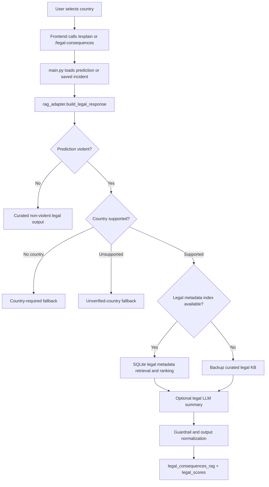
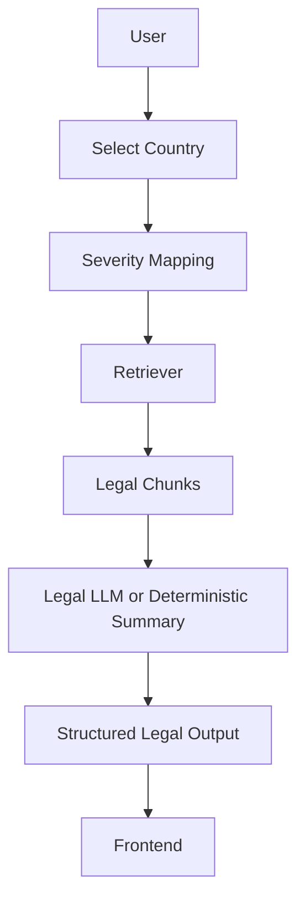
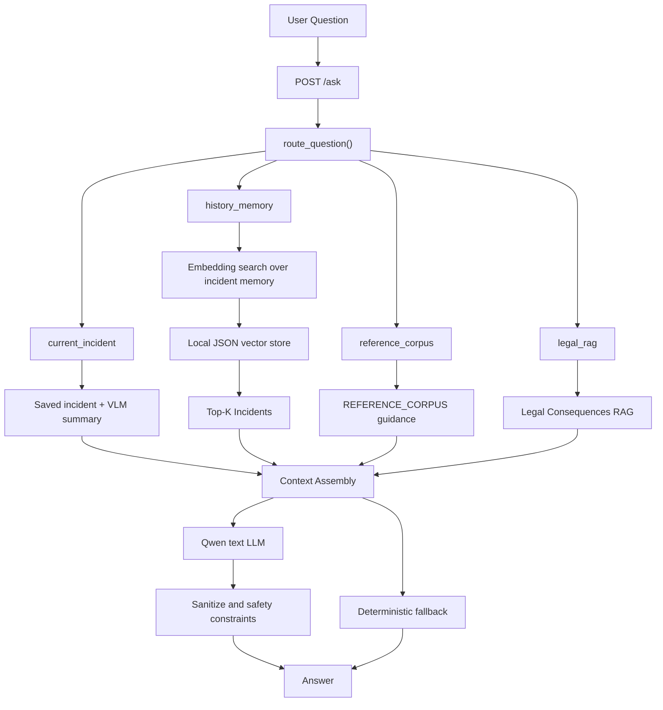
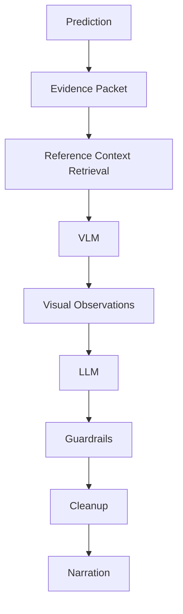
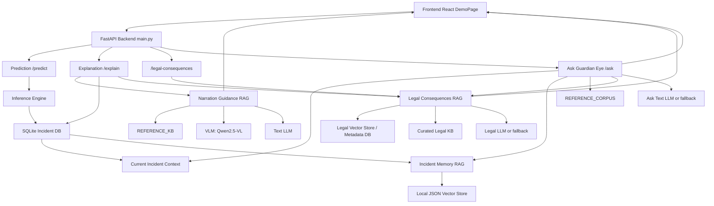

# Guardian Eye RAG Systems README

This document explains the Retrieval Augmented Generation architecture used by
Guardian Eye. It is written for graduation presentation preparation and team
handoff, so it focuses on what each subsystem does, why it exists, how the
request flows through the code, and what a presenter should say in Q&A.

Guardian Eye currently has three RAG-style systems:

1. Legal Consequences RAG
2. Ask Guardian Eye
3. Narration Guidance RAG

They do not all use the same storage or retrieval style. Legal Consequences RAG
is closest to a traditional document RAG. Ask Guardian Eye combines current
incident context, incident-memory retrieval, reference guidance, and legal RAG.
Narration Guidance RAG is intentionally not document evidence retrieval: it
retrieves short guidance entries that constrain how the VLM/LLM should narrate
the classifier result.

## Canonical Runtime

The richest current demo backend lives in `Backend_Ashour/BackEnd`. The older
`BackEnd` folder mirrors part of the earlier FastAPI stack, but the current
implementation details in this README are based on:

- `Backend_Ashour/BackEnd/main.py`
- `Backend_Ashour/BackEnd/schemas.py`
- `Backend_Ashour/BackEnd/services/rag_adapter.py`
- `Backend_Ashour/BackEnd/services/curated_legal_service.py`
- `Backend_Ashour/BackEnd/ask_rag_service.py`
- `Backend_Ashour/BackEnd/incident_memory_service.py`
- `Backend_Ashour/BackEnd/narration_service.py`
- `Backend_Ashour/BackEnd/explanation_service.py`
- `FULL_RAG_Pipeline/rag_service/*`

The frontend calls these systems through `FrontEnd/src/api/guardianApi.ts` and
renders them mainly in:

- `FrontEnd/src/components/LegalConsequencesPanel.tsx`
- `FrontEnd/src/components/AskBox.tsx`
- `FrontEnd/src/components/NarrativePanel.tsx`
- `FrontEnd/src/pages/DemoPage.tsx`

## RAG 1 - Legal Consequences RAG

### Purpose

Legal Consequences RAG explains possible legal consequences for a classified
incident in a selected jurisdiction. It does not decide guilt, identify an
attacker or victim, predict a court outcome, or give legal advice.

The system receives an already analyzed incident, uses the model verdict and
telemetry as safe query inputs, retrieves country-specific legal references,
and generates a cautious structured legal output for the UI.

### Why It Exists

The violence detector can say that a clip crossed or did not cross the model
threshold. It cannot safely explain laws by itself. Legal Consequences RAG adds
a grounded, jurisdiction-specific layer so presenters can show that Guardian Eye
does more than classify video: it can support incident review with references
and limitations.

This subsystem exists because a pure LLM would be risky for legal content. The
code constrains the legal answer to retrieved context, supported countries, and
guardrails.

### User Flow

1. User uploads or selects an incident.
2. Frontend gets a prediction through `POST /predict`.
3. Frontend calls `POST /explain` with `clip_id`, `language`, and optionally
   `country`.
4. If a country is selected, the backend returns `legal_consequences_rag`.
5. If the user later opens a historical incident and selects a country,
   `FrontEnd/src/api/guardianApi.ts` calls `POST /legal-consequences`.
6. `LegalConsequencesPanel.tsx` displays the country, summary, references,
   warnings, scores, and limitations.

### Backend Flow

Primary endpoint wiring is in `Backend_Ashour/BackEnd/main.py`.

- `POST /explain` builds the prediction packet, saves the incident, and calls
  `build_full_rag_response()`.
- `POST /legal-consequences` loads a saved incident by `incident_id` or
  `clip_id`, reconstructs a `PredictResponse`, and calls `build_legal_response()`.
- `build_legal_response()` lives in
  `Backend_Ashour/BackEnd/services/rag_adapter.py`.

The Legal RAG backend path is:



### Retrieval Flow

There are two legal retrieval paths.

The current demo adapter uses a local legal metadata store when available:

- `FULL_RAG_Pipeline/data/legal_metadata.db`
- `FULL_RAG_Pipeline/data/legal_faiss.index`
- `Backend_Ashour/BackEnd/services/rag_adapter.py`

`rag_adapter.py` loads rows from the SQLite metadata database for the selected
country, ranks them with `_rank_legal_rows()`, converts them into references
with `_reference_from_metadata_dict()`, and keeps the top references.

The standalone RAG package also contains the full FAISS retrieval path:

- `FULL_RAG_Pipeline/rag_service/legal_index.py`
- `FULL_RAG_Pipeline/rag_service/legal_retrieval.py`
- `FULL_RAG_Pipeline/rag_service/legal_orchestrator.py`

In `legal_retrieval.py`, `retrieve_legal_references()` embeds a query built
from verdict, packet summary, narrative, and weapon context. It searches the
FAISS index, then applies a hard country filter so a Canada request cannot
receive UK, UAE, KSA, Egypt, or California references. It then reranks by a
combined score:

- embedding similarity
- keyword overlap
- country match
- official-source flag
- article-number availability

### Embedding Flow

The standalone legal index layer uses sentence-transformers embeddings:

- Default model: `intfloat/multilingual-e5-base`
- Large model constant: `intfloat/multilingual-e5-large`
- Provider class:
  `FULL_RAG_Pipeline/rag_service/legal_index.py::SentenceTransformerEmbeddingProvider`

Indexing embeds legal chunks as passages:

```text
passage: <legal chunk text>
```

Retrieval embeds the user/legal query as:

```text
query: <verdict + packet + narrative + weapon terms>
```

Both vectors are normalized and searched with FAISS inner product.

The adapter in `Backend_Ashour/BackEnd/services/rag_adapter.py` can also use
SQLite metadata rows directly as a defense-day compatible path even when the
full embedding provider is not loaded.

### Vector Store Flow

The legal vector store consists of:

- FAISS index: `FULL_RAG_Pipeline/data/legal_faiss.index`
- SQLite metadata DB: `FULL_RAG_Pipeline/data/legal_metadata.db`
- Curated markdown legal docs:
  `FULL_RAG_Pipeline/data/legal_curated_docs/`

The build scripts are:

- `FULL_RAG_Pipeline/scripts/build_legal_index.py`
- `FULL_RAG_Pipeline/scripts/build_curated_legal_markdown.py`

The index stores vectors only. The SQLite DB stores aligned metadata:

- `vector_row`
- `chunk_id`
- `country`
- `source_language`
- `law_title`
- `article_number`
- `section_title`
- `violence_category`
- `source_url`
- `official_source`
- `text`
- `matched_keywords`

### LLM Generation Flow

Legal generation is optional and guarded.

In the adapter path:

- `GUARDIAN_LEGAL_LLM_ENABLED=1` allows an LLM attempt.
- Model comes from `GUARDIAN_LEGAL_LLM_MODEL_ID`, `GUARDIAN_LLM_MODEL_ID`, or
  the default from `curated_legal_service.py`.
- The default is a local `models/qwen2.5-1.5b-instruct` if present, otherwise
  `Qwen/Qwen2.5-3B-Instruct-AWQ`.

The legal prompt is built in:

- `Backend_Ashour/BackEnd/services/curated_legal_service.py::build_legal_prompt`

The prompt tells the model:

- use retrieved curated legal context only
- do not scrape websites
- do not identify attacker or victim
- do not determine guilt, intent, legal certainty, exact penalty, or court
  outcome
- do not repeat incident narration
- include cautious wording such as "If responsibility is confirmed by
  authorities"
- include "not legal advice"

If the LLM fails, is disabled, cannot load locally, runs out of memory, or
fails guardrails, the system returns a deterministic curated fallback summary.

### Fallback Behavior

Legal fallback is explicit and visible in response fields:

- `legal_rag_source`: `real`, `mock`, or `fallback`
- `legal_mode`: `llm` or `curated_fallback`
- `legal_rag_warning`
- `reason_if_fallback`
- `guardrail_status`

Fallback cases:

- No country selected: response asks the user to select a country.
- Unsupported country: response warns that no curated local references exist.
- Non-violent prediction: response says no violence-specific legal consequence
  should be inferred.
- Legal index unavailable: system uses backup curated KB.
- LLM unavailable: system uses deterministic summary from retrieved records.
- Guardrail failure: system blocks or replaces unsafe generation.

### Files Involved

Backend:

- `Backend_Ashour/BackEnd/main.py`
- `Backend_Ashour/BackEnd/schemas.py`
- `Backend_Ashour/BackEnd/services/rag_adapter.py`
- `Backend_Ashour/BackEnd/services/curated_legal_service.py`
- `Backend_Ashour/BackEnd/text_quality.py`

Full RAG package:

- `FULL_RAG_Pipeline/rag_service/legal_sources.py`
- `FULL_RAG_Pipeline/rag_service/legal_scraper.py`
- `FULL_RAG_Pipeline/rag_service/legal_cleaner.py`
- `FULL_RAG_Pipeline/rag_service/legal_chunker.py`
- `FULL_RAG_Pipeline/rag_service/legal_index.py`
- `FULL_RAG_Pipeline/rag_service/legal_retrieval.py`
- `FULL_RAG_Pipeline/rag_service/legal_summarizer.py`
- `FULL_RAG_Pipeline/rag_service/legal_guardrails.py`
- `FULL_RAG_Pipeline/rag_service/legal_evaluation.py`
- `FULL_RAG_Pipeline/rag_service/legal_orchestrator.py`
- `FULL_RAG_Pipeline/data/legal_curated_docs/`
- `FULL_RAG_Pipeline/data/legal_faiss.index`
- `FULL_RAG_Pipeline/data/legal_metadata.db`

Frontend:

- `FrontEnd/src/api/guardianApi.ts`
- `FrontEnd/src/components/CountrySelector.tsx`
- `FrontEnd/src/components/LegalConsequencesPanel.tsx`
- `FrontEnd/src/types/guardian.ts`

### API Endpoints Involved

- `POST /explain`
- `POST /legal-consequences`
- `GET /incident/{incident_id}`
- `GET /history`

### Example Request

```http
POST /legal-consequences
Content-Type: application/json

{
  "incident_id": "3f9a1f8b-8b8e-4c2f-bd7b-9f2d0b4a88a1",
  "country": "Canada",
  "language": "en"
}
```

### Example Response

```json
{
  "legal_consequences_rag": {
    "country": "Canada",
    "query_basis": {
      "verdict": "violence",
      "weapon_flag": true,
      "weapon_class": "bottle"
    },
    "retrieved_legal_references": [
      {
        "law_title": "Criminal Code Section 267",
        "article_number": "267",
        "section_title": "Assault with a weapon or causing bodily harm",
        "source_url": "https://laws-lois.justice.gc.ca/eng/acts/c-46/section-267.html",
        "snippet": "Curated excerpt for the selected country and violence category...",
        "score": 0.86,
        "country": "Canada",
        "violence_category": "weapon_or_dangerous_object",
        "official_source": true
      }
    ],
    "summary": "If responsibility is confirmed by authorities, the Canada incident classified as violent with a weapon/object context may require review under retrieved assault and weapon-related references. This is not legal advice.",
    "guardrail_status": "passed",
    "limitations_note": "This is not legal advice, does not determine guilt, and does not predict court outcome.",
    "rag_mode": "auto",
    "legal_rag_source": "real",
    "legal_mode": "curated_fallback",
    "legal_rag_warning": "Curated legal references retrieved successfully.",
    "reason_if_fallback": "Legal LLM model unavailable locally"
  },
  "legal_scores": {
    "retrieval_score": 0.86,
    "generation_score": 0.72,
    "overall_score": 0.79,
    "passed": true
  },
  "language": "en"
}
```

### Legal Documents Used

The source registry in `FULL_RAG_Pipeline/rag_service/legal_sources.py`
currently includes:

- UK:
  - Offences Against the Person Act 1861
  - Crime and Disorder Act 1998
  - Public Order Act 1986
  - Criminal Justice Act 2003
- USA California:
  - California Penal Code Section 240
- Canada:
  - Criminal Code Section 265
  - Criminal Code Section 267
  - Criminal Code Page 38
- KSA:
  - Protection from Abuse Law
  - Executive Regulations of the Protection from Abuse Law
- UAE:
  - UAE Crimes and Penalties Law
  - UAE Crimes and Penalties Law PDF
  - UAE public legal content asset
- Egypt:
  - Egyptian Penal Code Law No. 58 of 1937

The curated markdown artifacts are in:

- `FULL_RAG_Pipeline/data/legal_curated_docs/canada_legal_consequences.md`
- `FULL_RAG_Pipeline/data/legal_curated_docs/uk_legal_consequences.md`
- `FULL_RAG_Pipeline/data/legal_curated_docs/usa_legal_consequences.md`
- `FULL_RAG_Pipeline/data/legal_curated_docs/uae_legal_consequences.md`
- `FULL_RAG_Pipeline/data/legal_curated_docs/ksa_legal_consequences.md`
- `FULL_RAG_Pipeline/data/legal_curated_docs/egypt_legal_consequences.md`

### Severity Mapping

Severity is not guessed by the LLM. It is derived in code.

In `curated_legal_service.py::infer_severity()`:

- VLM severity can be used if it is one of `low`, `medium`, or `high`.
- Physical altercation terms in VLM observations push toward `medium`.
- A real dangerous object or high classifier confidence pushes toward `high`.
- Four or more people, or explicit severe/high terms, push toward `high`.
- Otherwise, the default is `medium`.

In `rag_adapter.py::_metadata_reference_severity()`:

- weapon flag or confidence greater than or equal to `0.82` maps to `high`
- four or more tracked people maps to `high`
- otherwise maps to `medium`

### Country Selection

The selected country comes from the frontend `CountrySelector` and is passed as
`country` to `/explain`, `/legal-consequences`, and `/ask`.

Supported aliases are normalized in:

- `rag_adapter.py::SUPPORTED_LEGAL_COUNTRIES`
- `curated_legal_service.py::COUNTRY_ALIASES`
- `legal_retrieval.py::_canonical_country()`

Supported countries are:

- Canada
- UK
- USA California
- UAE
- KSA
- Egypt

Unsupported countries are excluded because legal guidance without curated local
references would encourage hallucination. The code returns a warning instead of
letting the LLM invent jurisdiction-specific consequences.

### Citations and Source Links

Citations are produced as `retrieved_legal_references`. Each reference includes:

- `law_title`
- `article_number`
- `section_title`
- `source_url`
- `snippet`
- `score`
- `country`
- `violence_category`
- `official_source`

Source links come directly from the metadata row or curated record. In the full
legal source registry they are official or marked non-official with
`official_source: false`. In the backup curated service, demo references use
`curated-legal-kb://...` URLs so the UI can still show the shape while making it
clear that the source is curated demonstration context.

### Hallucination Prevention

The legal subsystem prevents hallucination through:

- supported-country gating
- hard country filtering in `legal_retrieval.py`
- retrieved references included in output
- legal prompt boundaries
- deterministic fallback when models fail
- `_guardrail_ok()` checks for attacker, victim, guilt, conviction, and legal
  certainty terms
- `limitations_note` on every output
- person-object cleanup that prevents a detected `person` class from being
  treated as a dangerous weapon

### Pipeline Diagram



### Limitations

- The system is a presentation-safe legal context layer, not legal advice.
- Exact penalties and court outcomes are intentionally not generated unless
  explicitly present in retrieved context.
- Unsupported countries return fallback warnings.
- The full FAISS embedding provider may be unavailable on the demo machine.
- LLM generation may fall back because local model files, GPU memory, or AWQ
  dependencies are unavailable.
- The current `/explain` response includes mocked `explanation_rag` and
  `incident_memory_rag` fields in `rag_adapter.py`; the stronger Ask memory path
  is implemented separately in `incident_memory_service.py`.

### Future Improvements

- Expand official legal source coverage by jurisdiction.
- Add more article-level curated markdown and metadata rows.
- Enable full FAISS retrieval by default in production environments.
- Store retrieval traces for audit and presentation debugging.
- Add legal-domain evaluation cases per country.
- Add reviewer workflow where legal experts approve curated chunks.
- Improve Arabic legal summaries with verified jurisdiction-specific phrasing.

## RAG 2 - Ask Guardian Eye

### Purpose

Ask Guardian Eye lets users ask natural-language questions about the current
incident, historical incidents, system guidance, and legal context.

It answers questions such as:

- "Why was this video classified as violent?"
- "Which stream contributed most?"
- "How many people were visible?"
- "Show similar incidents from last week."
- "What are possible legal consequences in Canada?"

### Why It Exists

A dashboard is useful, but examiners and operators often ask follow-up
questions. Ask Guardian Eye provides an interactive explanation layer that
turns saved incident data, semantic incident memory, reference guidance, and
legal retrieval into a concise answer.

It also demonstrates why RAG is needed: answers are grounded in saved records
and retrieved context instead of free-form LLM imagination.

### User Flow

1. User types a question in `AskBox.tsx`.
2. `FrontEnd/src/api/guardianApi.ts::askGuardianEye()` sends the question to
   `POST /ask`.
3. The frontend includes optional `clip_id`, `incident_id`, `country`, and
   `language`.
4. Backend routes the question.
5. Backend retrieves context.
6. Backend tries the Ask LLM.
7. If the LLM cannot run, backend returns deterministic fallback.
8. UI displays `answer`, related incident IDs, route, context count, and fallback
   diagnostics.

### Backend Flow

`POST /ask` is defined in `Backend_Ashour/BackEnd/main.py`.

It calls:

- `explanation_service.answer_question()`
- which delegates to `ask_rag_service.answer_question_rag_result()`

The main service file is:

- `Backend_Ashour/BackEnd/ask_rag_service.py`

Question routes are:

- `current_incident`
- `history_memory`
- `reference_corpus`
- `legal_rag`

### Retrieval Flow

Ask retrieval is route-dependent.

For `current_incident`:

- Load the selected or latest incident from SQLite.
- Add VLM summary context if saved.
- Add current incident record context.
- Add matching reference guidance from `REFERENCE_CORPUS`.

For `history_memory`:

- Optionally use the explicit current record.
- Call `incident_memory_service.memory_context_item()`.
- Retrieve historical records with filters like violence, non-violence, weapon,
  last week, yesterday, or today.
- Add history/memory guidance from `REFERENCE_CORPUS`.

For `legal_rag`:

- Load current or selected incident.
- Add VLM summary if available.
- Reconstruct a `PredictResponse`.
- Call `build_legal_response()` from `services/rag_adapter.py`.
- Add legal boundary guidance.

For `reference_corpus`:

- Retrieve static system guidance entries from `REFERENCE_CORPUS`.

### Embedding Search

Historical semantic retrieval is implemented in:

- `Backend_Ashour/BackEnd/incident_memory_service.py`

It maintains a small JSON vector cache:

- `Backend_Ashour/BackEnd/db/incident_memory_store.json`

The embedding is deterministic and CPU-only:

- dimension: `256`
- function: `embed_text()`
- method: hashed lexical vectors with token weights
- similarity: cosine

The text embedded for each incident includes:

- source
- clip ID
- verdict
- confidence
- people count
- peak frames
- weapon/object flag
- gate weights
- packet summary
- narrative

If embedding search is disabled or fails, it falls back to keyword search.

### Context Building

The retrieved context passed to the Ask LLM is JSON containing:

- selected route
- original query
- warnings
- retrieved context items

Context items can include:

- `current_vlm_summary`
- `current_incident`
- `history_memory`
- `incident_memory_rag`
- `legal_rag`
- `reference_corpus`

The Ask prompt is built in:

- `ask_rag_service.py::build_ask_prompt()`

The system message says:

- answer using retrieved context only
- do not invent unavailable information
- do not reclassify the video
- do not identify attacker or victim roles
- do not assign guilt
- do not predict court outcomes
- for stream/gate questions, use telemetry first
- do not expose internal labels like `VLM summary` or `retrieved_context`

### LLM Generation Flow

The Ask LLM defaults to:

```text
Qwen/Qwen2.5-3B-Instruct-AWQ
```

Environment variables:

- `GUARDIAN_ASK_RAG_ENABLED`
- `GUARDIAN_ASK_LLM_MODEL_ID`
- `GUARDIAN_MODEL_LOCAL_ONLY`

The model is loaded inside `_run_ask_llm()`, used for one answer, then released
with garbage collection and CUDA cache cleanup.

For special questions, Ask can answer deterministically without calling the LLM:

- people-count questions
- gate/stream contribution questions
- legal fallback summaries from retrieved legal context

### Citation Generation

Ask does not render formal footnote citations, but it returns traceable context:

- `selected_route`
- `retrieved_context_count`
- `related_incident_ids`
- legal references inside the legal context path
- `summary_source`
- `vlm_summary_used`

The frontend normalizes this in `normalizeBackendAskResponse()` and displays the
answer and related confidence.

### Safety Filtering

Ask safety is enforced in several places:

- route selection avoids using legal answers unless the question asks for legal
  content
- prompt prohibits attacker/victim/guilt/court outcome claims
- `_sanitize_ask_answer()` removes internal terms
- current-person answers avoid role assignment
- legal answers come from Legal Consequences RAG
- fallback answers are deterministic and based on saved records

### Fallback Behavior

Fallback occurs when:

- Ask RAG is disabled with `GUARDIAN_ASK_RAG_ENABLED=0`
- context retrieval fails
- no context is available
- local model files are unavailable
- GPU memory is insufficient
- the LLM returns empty or invalid Arabic text

The response exposes:

- `ask_mode`: `llm` or `fallback`
- `selected_route`
- `retrieved_context_count`
- `reason_if_fallback`

### Files Involved

Backend:

- `Backend_Ashour/BackEnd/main.py`
- `Backend_Ashour/BackEnd/schemas.py`
- `Backend_Ashour/BackEnd/explanation_service.py`
- `Backend_Ashour/BackEnd/ask_rag_service.py`
- `Backend_Ashour/BackEnd/incident_memory_service.py`
- `Backend_Ashour/BackEnd/incident_service.py`
- `Backend_Ashour/BackEnd/database.py`
- `Backend_Ashour/BackEnd/services/rag_adapter.py`

Frontend:

- `FrontEnd/src/components/AskBox.tsx`
- `FrontEnd/src/api/guardianApi.ts`
- `FrontEnd/src/types/guardian.ts`
- `FrontEnd/src/pages/DemoPage.tsx`

### API Endpoints Involved

- `POST /ask`
- `GET /history`
- `GET /incident/{incident_id}`
- `POST /legal-consequences` through the legal route

### Example Request

```http
POST /ask
Content-Type: application/json

{
  "question": "Which stream contributed most in this incident?",
  "clip_id": "fight_1_20260615_143813_777527_fbc2495f.avi",
  "incident_id": "3f9a1f8b-8b8e-4c2f-bd7b-9f2d0b4a88a1",
  "country": "Canada",
  "language": "en"
}
```

### Example Response

```json
{
  "answer": "The Interaction stream contributed most with 41%. Full gate weights: Interaction 41%, Skeleton 34%, ViT/RGB 18%, Object 7%. ViT/RGB is shown as a raw gate percentage if its embedding is unavailable.",
  "incidents": [
    {
      "incident_id": "3f9a1f8b-8b8e-4c2f-bd7b-9f2d0b4a88a1",
      "clip_id": "fight_1_20260615_143813_777527_fbc2495f.avi",
      "timestamp": "2026-06-15T14:39:02",
      "source": "fight_1.avi",
      "verdict": "violence",
      "confidence": 0.94,
      "people_count": 2,
      "weapon_flag": true,
      "weapon_class": "bottle",
      "peak_window": [14, 22]
    }
  ],
  "language": "en",
  "ask_mode": "llm",
  "selected_route": "current_incident",
  "retrieved_context_count": 3,
  "reason_if_fallback": null,
  "vlm_summary_used": true,
  "summary_source": "current_vlm",
  "vlm_people_count": 2,
  "vlm_violence_type": "physical altercation"
}
```

### Detailed Pipeline Diagram



### Limitations

- Incident memory uses hashed lexical vectors, not Chroma in the current
  `Backend_Ashour` runtime.
- The older documentation may mention Chroma, but the current code uses
  `incident_memory_store.json`.
- Ask answers are only as complete as the saved incident records.
- The LLM is loaded locally and may fall back if unavailable.
- Some `/explain` RAG fields are mocked in `rag_adapter.py`; the richer
  semantic memory appears in `/ask`.
- Ask does not re-run model inference.

### Future Improvements

- Replace the local JSON incident memory with Chroma or FAISS for larger
  datasets.
- Add formal citations in Ask responses.
- Add route confidence and route explanations.
- Add streaming responses for long answers.
- Store prompt/context traces for examiner debugging.
- Improve Arabic query routing with normalized Arabic keywords.

## RAG 3 - Narration Guidance RAG

### Purpose

Narration Guidance RAG produces grounded narration for a prediction. It explains
what the system saw and why the classifier result should be interpreted the way
it is.

This is not traditional document retrieval. It does not retrieve external facts
about the incident. It retrieves short guidance entries that tell the VLM and
LLM how to narrate safely.

### Why It Exists

The classifier returns a verdict, confidence, gate weights, GQS, peak window,
people count, and weapon/object proximity. A raw LLM could overstate the scene,
reclassify the video, or assign human roles. Narration Guidance RAG exists to
turn the model outputs and selected frames into a human-readable explanation
without hallucinating.

### User Flow

1. User uploads video.
2. `/predict` returns classifier result.
3. Frontend calls `/explain`.
4. Backend builds an evidence packet and renders overlays.
5. `explanation_service.generate_explanation()` calls
   `narration_service.generate_grounded_narration_result()` in real mode.
6. Narration result is saved to SQLite with the incident.
7. Frontend displays the text in `NarrativePanel.tsx`.

### Backend Flow

Main files:

- `Backend_Ashour/BackEnd/explanation_service.py`
- `Backend_Ashour/BackEnd/narration_service.py`
- `Backend_Ashour/BackEnd/incident_service.py`
- `Backend_Ashour/BackEnd/main.py`

Narration begins after prediction. It never decides violence. The classifier
verdict is treated as final decision-support metadata.

### Retrieval Flow

The retrieval source is `REFERENCE_KB` in
`Backend_Ashour/BackEnd/narration_service.py`.

`REFERENCE_KB` entries include:

- classifier finality
- visual grounding
- high-confidence violent alert
- lower-confidence violent alert
- non-violence threshold explanation
- object proximity caveat
- multi-person scene
- gate contribution language
- peak-window caveat

`retrieve_reference_context()` builds query terms from:

- verdict
- confidence/severity
- gate contributors
- weapon/object flag
- people count
- peak window
- stream labels

It ranks guidance entries by tag overlap and returns the top entries.

### Embedding Flow

Narration Guidance RAG does not use vector embeddings. The guidance KB is small
and structured, so retrieval is deterministic tag-overlap scoring. That is
intentional: the goal is control and safety, not semantic discovery.

### Vector Store Flow

There is no vector store for narration guidance. The local in-code
`REFERENCE_KB` is the retrieval store.

Evidence frames are exported to local files for the VLM, but those frames are
not a vector database. They are direct visual evidence.

### Evidence Packet

`build_evidence_packet()` creates a structured packet containing:

- `clip_id`
- `verdict`
- `confidence`
- `threshold`
- `severity`
- `peak_window`
- `people_count`
- `weapon`
- `gate`
- `gqs`
- `dominant_contributors`
- selected evidence frame paths
- peak ViT frame indices
- `reference_context`
- caveats

This packet is the grounding contract for narration.

### VLM Observations

`_run_vlm()` uses:

```text
Qwen/Qwen2.5-VL-3B-Instruct-AWQ
```

or the `GUARDIAN_VLM_MODEL_ID` environment variable.

It receives selected evidence frame images and the evidence packet. It outputs
visual observations or final narration when `GUARDIAN_NARRATION_MODE=vlm_only`.

### LLM Narration

In normal `vlm_llm` mode, `_run_llm()` then uses:

```text
Qwen/Qwen2.5-3B-Instruct-AWQ
```

or `GUARDIAN_LLM_MODEL_ID`.

The LLM receives:

- VLM visual observations
- evidence packet
- retrieved reference guidance
- language instruction
- role-safety guidance

It generates the final narration in English or Arabic.

### Guardrails

Narration guardrails prevent:

- contradiction of the classifier verdict
- attacker/victim labels
- guilt or legal responsibility claims
- "started the fight" claims
- hidden internal artifacts like selected frame filenames
- raw telemetry jargon in final UI text
- unsupported precise timing claims

The code paths include:

- `_guardrail_ok()`
- `_sanitize_narrative_artifacts()`
- `_clean_person_description()`
- `_format_narrative_for_display()`
- `_deterministic_clean_narrative()`

### Translation

Arabic is supported through:

- `language: "ar"` in `/explain`
- `ARABIC_ONLY_INSTRUCTION` from `text_quality.py`
- Arabic labels in narration formatting
- retry/polish behavior when generated Arabic contains invalid mixed-language
  output

### Cleanup

After model calls, the code releases models and clears CUDA memory:

- VLM and LLM are loaded inside the function call.
- Each model is deleted after use.
- `gc.collect()` runs.
- CUDA cache is cleared if available.

This design keeps GPU memory available for sequential demo stages.

### Fallback Narration

Fallback occurs when:

- `GUARDIAN_NARRATION_ENABLED=0`
- cached NPZ frames are unavailable
- evidence frame export fails
- VLM is unavailable
- LLM is unavailable
- guardrails fail
- generated text is empty

Fallback text is deterministic and built from classifier outputs in
`explanation_service.py`.

Response fields expose the path:

- `narration_mode`: `vlm_llm`, `vlm_only`, or `fallback`
- `model_status`
- `reason_if_fallback`

### Files Involved

Backend:

- `Backend_Ashour/BackEnd/main.py`
- `Backend_Ashour/BackEnd/explanation_service.py`
- `Backend_Ashour/BackEnd/narration_service.py`
- `Backend_Ashour/BackEnd/incident_service.py`
- `Backend_Ashour/BackEnd/text_quality.py`
- `Backend_Ashour/BackEnd/overlay_service.py`

Stored data:

- `Backend_Ashour/BackEnd/db/guardian_eye.db`
- `Backend_Ashour/BackEnd/cache_npz/<clip_id>.npz`
- `Backend_Ashour/BackEnd/static/overlays/`
- `Backend_Ashour/BackEnd/static/thumbnails/`

Frontend:

- `FrontEnd/src/components/NarrativePanel.tsx`
- `FrontEnd/src/api/guardianApi.ts`
- `FrontEnd/src/pages/DemoPage.tsx`

### API Endpoints Involved

- `POST /predict`
- `POST /explain`
- `POST /overlay`
- `GET /incident/{incident_id}`

### Example Request

```http
POST /explain
Content-Type: application/json

{
  "clip_id": "fight_1_20260615_143813_777527_fbc2495f.avi",
  "language": "en",
  "country": "Canada"
}
```

### Example Response

```json
{
  "narrative": "Guardian Eye classified the clip as violent with 94.0% confidence. The analyzed video appears to show visible people in a close interaction. The exact sequence is unclear, and the result should be reviewed by a human operator.",
  "incident_id": "3f9a1f8b-8b8e-4c2f-bd7b-9f2d0b4a88a1",
  "language": "en",
  "narration_mode": "vlm_llm",
  "model_status": {
    "vlm": "released",
    "llm": "released"
  },
  "reason_if_fallback": null,
  "explanation_rag": {},
  "incident_memory_rag": {},
  "legal_consequences_rag": {}
}
```

### Pipeline Diagram



### Why Reference Context Is Guidance, Not Evidence

The narration `reference_context` does not prove what happened in the video. It
only tells the model how to phrase the explanation safely.

Evidence is:

- selected video frames
- classifier verdict
- confidence
- gate weights
- GQS
- people count
- peak window
- weapon/object proximity flag

Guidance is:

- "do not reclassify"
- "describe only visible observations"
- "object proximity is not proof of use"
- "avoid attacker/victim labels"
- "peak window is highest activity, not exact start time"

This distinction is important in presentation Q&A.

### Attacker/Victim and Legal Responsibility Prevention

The narration subsystem deliberately avoids:

- "attacker"
- "victim"
- "guilty"
- "culprit"
- "legally responsible"
- "started the fight"
- "committed assault"

If generated person descriptions contain forbidden terms, they are removed or
the narration falls back to a deterministic clean version.

### Limitations

- Real narration requires cached `frames_vit` in NPZ.
- VLM/LLM local model loading can fail on low-memory machines.
- VLM observations are only from selected frames, not the full video.
- The system cannot identify intent or responsibility.
- The fallback narration is less visually rich but safer.

### Future Improvements

- Add frame-level evidence thumbnails beside narration.
- Persist reference-context IDs for audit.
- Add human-editable narration review before export.
- Add multilingual evaluation tests for guardrails.
- Add richer object taxonomy filtering so ordinary objects are not overstated.

## Cross-RAG Architecture

The three systems coexist around one shared incident lifecycle:

1. `/predict` creates classifier output.
2. `/explain` saves the incident and runs narration plus RAG enrichment.
3. `/legal-consequences` can regenerate legal output for a saved incident and
   selected country.
4. `/ask` uses saved incidents, incident memory, reference guidance, and legal
   RAG to answer user questions.

They share:

- `PredictResponse`
- `IncidentRecord`
- SQLite incident DB
- optional VLM summaries
- frontend API normalization
- language setting
- country setting

They differ in retrieval:

- Legal RAG retrieves legal chunks or curated legal records.
- Ask RAG retrieves incident memory, current incident records, reference
  guidance, and legal context.
- Narration RAG retrieves in-code guidance entries and visual evidence frames.

### Cross-RAG Diagram



## Presentation Summary

When explaining the RAG layer, use this phrasing:

Guardian Eye uses RAG in three different ways. Legal RAG is the traditional
document-grounded path: it retrieves jurisdiction-specific legal references and
generates a cautious legal summary with citations. Ask Guardian Eye is an
interactive RAG assistant over saved incidents, current prediction evidence,
reference guidance, and legal context. Narration Guidance RAG is different: it
retrieves safety guidance and combines it with visual observations so the
narration stays grounded, avoids hallucination, and never assigns guilt or
human roles.
